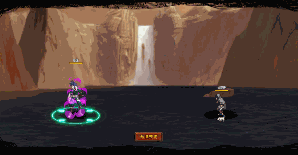

# Guren

<figure><figcaption></figcaption></figure>

* Lực tay: 34.000 (33%)
* Nhanh nhẹn: 29.000 (30%)
* Tinh thần: 29.000 (30%)
* Thể lực: 360.000 (34%)

### Thiên phú

* Tăng lượng lớn lực tay và thể lực theo phần trăm. Bẩm sinh có 82% tốc độ, 60% tỷ lệ tổn thương và 60% tỷ lệ miễn thương. Khi ninja này lên trận, giảm phe địch 52% tốc độ và 30% lực công. Tăng toàn quân ta 30% HP và 30% phòng thủ. Bản thân có sẵn 40% tỷ lệ đỡ đòn (Có thể đột phá giới hạn) và 60% S.Đỡ đòn. Bản thân có 50% kháng khống chế. Miễn dịch Băng Phong, Giam Cầm và Tử Vong Chủng.
* **Thức tỉnh cấp 1:** Có 70% hồi 30 nộ cho đồng minh khi bị tấn công.

### Kỹ năng

* Tấn công 3 quân địch bất kì với hệ số 400%. Có 100% tỷ lệ gây Băng Phong địch trong 2 hiệp, xóa hiệu ứng bất lợi phe ta. Giảm hàng giữa/sau địch 40% tỷ lệ tổn thương và hàng đầu địch 50% phòng thủ trong 2 hiệp. Tăng toàn quân bên ta 40% tỷ lệ cứu viện trong 2 hiệp. Hồi bản thân 50 nộ và đồng đội 30 nộ.
* **Thức tỉnh lần 1:** Giảm kẻ địch nhiều máu nhất 30% tỷ lệ miễn thương trong 2 hiệp.

| Chi Tiết Hiệu Ứng                                                                                                                                          |
| ---------------------------------------------------------------------------------------------------------------------------------------------------------- |
| **Giam Cầm và Băng Phong:** CC cứng                                                                                                                        |
| **S.Đỡ đòn:** Khi thực hiện đỡ đòn, sẽ trừ % HP của kẻ bị đỡ đòn bằng % S.Đỡ đòn sở hữu                                                                    |
| **Chủng Tử Vong:** Chết ngay lập tức khi đến lượt \[ngoài trừ lượt Hợp Kích (nhưng hợp kích vẫn tính lượt có thể lợi dụng Hợp Kích để giải Chủng Tử Vong)] |
