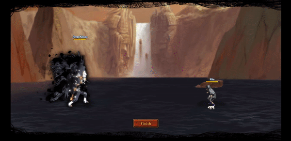

# Jiongu Kakuzu

<figure><figcaption></figcaption></figure>

* Lực tay: 39.000 (39%)
* Nhanh nhẹn: 36.000 (36%)
* Tinh thần: 27.000 (27%)
* Thể lực: 430.000 (43%)

### Thiên phú

* Tăng lượng lớn nhạy bén, thể lực và lực tay theo phần trăm. Bẩm sinh có 86% tốc độ, 70% tỷ lệ tổn thương và 65% tỷ lệ miễn thương. Khi ninja này lên trận, tăng toàn quân ta 112% tốc độ và 30% máu của tất cả các đồng minh, tăng đồng minh mang ngũ hành <mark style="color:orange;">**Thổ**</mark> và <mark style="color:green;">**Phong**</mark> 35% miễn thương và 20% máu, tăng đồng minh mang ngũ hành <mark style="color:purple;">**Lôi**</mark> và <mark style="color:red;">**Hỏa**</mark>** ** 40% tỷ lệ tổn thương và 20% tỷ lệ hợp kích, tăng đồng minh mang ngũ hành <mark style="color:blue;">**Thủy**</mark>** ** 35% phòng thủ và lực công. Với mỗi 10% HP mất tăng đồng minh (trừ bản thân) 5% lực công và 10% phòng thủ. Sau khi chết, hồi sinh với 80% HP, kích hoạt 1 lần/1 trận đấu. Sau khi bị tân công, có 50% khiến kẻ tấn công vào trạng thái Độc Phong trong 2 hiệp và có 50% đưa bản thân vào trạng thái Phá Phong trong 2 hiệp. Bản thân bỏ qua 60% tỷ lệ thành công khống chế của kẻ địch và phản thương hệ số 150%. Miễn dịch Phong Ấn, Giảm Nộ và Chủng Tử Vong.
* **Thức tỉnh lần 1:** Tăng bản thân 30% tỷ lệ đỡ đòn và 30% tỷ lệ bạo kích (có thể vượt giới hạn)

### Kỹ năng

* Tấn công tất cả kẻ địch mang ngũ hành <mark style="color:green;">**Phong**</mark>/<mark style="color:orange;">**Thổ**</mark>/<mark style="color:red;">**Hỏa**</mark>/<mark style="color:purple;">**Lôi**</mark>/<mark style="color:blue;">**Thủy**</mark>** ** hệ số lần lượt 450%/450%/300%/300%/400%, đối với kẻ địch không mang ngũ hành hệ số 500%. Gây cho toàn bộ kẻ địch Cắt Máu, Thiêu Nướng và Bạo Liệt (3 DOT hệ số 120%), gây cho kẻ địch mang ngũ hành **Phong** và **Lôi** vào trạng thái Suy Yếu trong 2 hiệp, xóa toàn bộ địch hiệu ứng tăng ích, tăng đồng minh hàng giữa/sau 80% phòng thủ trong 2 hiệp. Hồi bản thân 68 nộ, tất cả đồng minh trừ bản thân 30 nộ.

| Chi Tiết Hiệu Ứng                                                                                                                                          |
| ---------------------------------------------------------------------------------------------------------------------------------------------------------- |
| **Cắt Máu, Thiêu Nướng và Bạo Liệt:** DOT mềm                                                                                                              |
| **Phong Ấn (CC cứng):** Không thể tung kỹ năng.                                                                                                            |
| **Chủng Tử Vong:** Chết ngay lập tức khi đến lượt \[ngoài trừ lượt Hợp Kích (nhưng hợp kích vẫn tính lượt có thể lợi dụng Hợp Kích để giải Chủng Tử Vong)] |
| **Độc Phong:** Không thể hành động. Trừ 30% HP hiện tại. Không thể xua tan.                                                                                |
| **Phá Phong:** Tăng 30% lực công và phòng thủ. Không thể xua tan.                                                                                          |
| **Suy Yếu:** Giảm 40% tốc độ và phòng thủ và không thể nhận được hiệu ứng tăng ích. Không thể xua tan.                                                     |
