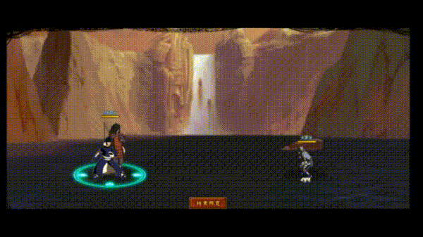

# Madara\&Obito

<figure><figcaption></figcaption></figure>

* Lực tay: 15.000 (12.5%)
* Nhanh nhẹn: 13.000 (11%)
* Tinh thần: 13.000 (11%)
* Thể lực: 140.000 (16%)

### Thiên phú

* Tăng lượng lớn lực tay và thể lực theo phần trăm. Bẩm sinh có 35% tốc độ, 40% tỷ lệ tổn thương và 35% tỷ lệ miễn thương. Khi ninja này tấn công, bỏ qua phòng thủ của kẻ địch. Khi ninja này lên trận, tăng đồng minh 35% tốc độ, 20% lực công và 15% tỷ lệ miễn thương. Khi bị tấn công, 75% hồi bản thân 30 nộ. Với mỗi 10% HP mất, tăng bản thân 10% tỷ lệ tổn thương và tỷ lệ miễn thương. Miễn dịch với Tê Liệt, Đuổi và Mù.

### Kỹ năng

* Tấn công tất cả kẻ địch hệ số 320%. Có 80% tỷ lệ gây Hỗn Loạn kẻ địch trong 2 hiệp. Tăng hàng giữa đồng minh 70% tỷ lệ cứu viện trong 2 hiệp. Xóa hiệu ứng bất lợi hàng sau đồng minh. Giảm bản thân 30% tỷ lệ miễn thương trong 2 hiệp. Giảm kẻ địch 20% lực công trong 2 hiệp và tăng hàng sau đồng minh 10% tốc độ trong 2 hiệp.

| Chi Tiết Hiệu Ứng                                       |
| ------------------------------------------------------- |
| **Hỗn Loạn (CC mềm):** Tấn công đồng minh (Đánh Thường) |
| **Tê Liệt và Đuổi:** CC mềm                             |
| **Mù:** CC cứng                                         |
