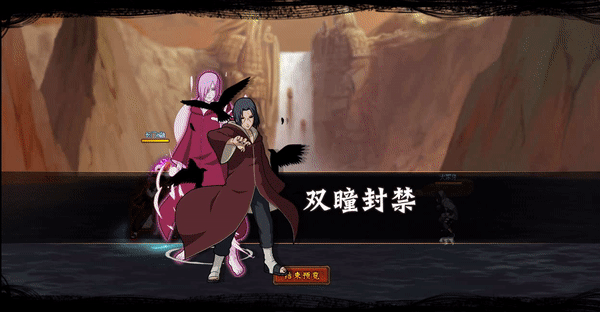

# Nagato\&Itachi

<figure><figcaption></figcaption></figure>

* Lực tay: 24.000 (24%)
* Nhanh nhẹn: 22.000 (22%)
* Tinh thần: 22.000 (22%)
* Thể lực: 280.000 (28%)

### Thiên phú

* Tăng lượng lớn thể lực và lực tay theo tỷ lệ phần trăm. Bẩm sinh có 60% tốc độ, 50% tỷ lệ tổn thương và 50% tỷ lệ miễn thương. Bỏ qua phòng thủ kẻ địch. Khi ninja này lên trận, giảm quân địch 45% tốc độ và giảm hàng sau kẻ địch 20% lực công, tăng hàng đầu/giữa đồng minh 30% tỷ lệ miễn thương và hàng sau đồng minh 30% HP. Khi bị tấn công, 60% xóa hiệu ứng bất lợi bản thân. Miễn nhiễm với Băng Phong và Mù.

### Kỹ năng

* Tấn công tất cả kẻ thù hệ số 300%. Có 70% tỷ lệ gây Chấn Nhiếp hoặc Điểm Huyệt kẻ địch trong 2 hiệp. Tăng hàng sau đồng minh 30% tỷ lệ miễn thương và tỷ lệ hợp kích. Giảm hàng giữa/sau kẻ địch 20% tỷ lệ tổn thương và quân địch 50% tỷ lệ né tránh trong 2 hiệp. Áp dụng Miễn Khống Chế cho 1 đồng minh bất kỳ trong 2 hiệp. Hồi bản thân 50 nộ.

| Chi Tiết Hiệu Ứng                    |
| ------------------------------------ |
| **Băng Phong và Mù:** CC cứng        |
| **Chấn Nhiếp và Điểm Huyệt:** CC mềm |
