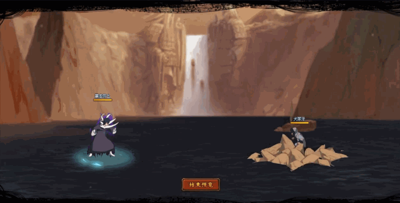

# Obito Bạch Zetsu

<figure><figcaption></figcaption></figure>

* Lực tay: 25.000 (25%)
* Nhanh nhẹn: 23.000 (23%)
* Tinh thần: 23.000 (23%)
* Thể lực: 300.000 (30%)

### Thiên phú

* Tăng lượng lớn thể lực và lực tay theo phần trăm. Bẩm sinh có 70% tốc độ, 55% tỷ lệ tổn thương và 45% tỷ lệ miễn thương. Khi ninja này lên trận, tăng đồng minh 87% tốc độ và 25% tỷ lệ tổn thương. Giảm quân địch 20% tỷ lệ miễn thương. Tăng HP bản thân thêm 60%. Khi bị tấn công, phản sát thương hệ số 120% kẻ tấn công. Bản thân có 40% kháng khống chế. Miễn dịch Chủng Tử Vong và Giảm Nộ.

### Kỹ năng

* Tấn công tất cả kẻ địch hệ số 300%. Có 70% tỷ lệ gây Cấm Kỹ kẻ địch trong 2 hiệp. Hồi HP đồng minh hệ số 120%. Tăng đồng minh 30% lực công. Giảm kẻ địch 50% tỷ lệ cứu viện trong 2 hiệp. Xóa hiệu ứng bất lợi của hàng giữa/sau đồng minh. Hồi bản thân 50 nộ, đồng minh 30 nộ.

| Chi Tiết Hiệu Ứng                                                                                                                                          |
| ---------------------------------------------------------------------------------------------------------------------------------------------------------- |
| **Cấm Kỹ (CC mềm):** Không thể tung kỹ năng.                                                                                                               |
| **Chủng Tử Vong:** Chết ngay lập tức khi đến lượt \[ngoài trừ lượt Hợp Kích (nhưng hợp kích vẫn tính lượt có thể lợi dụng Hợp Kích để giải Chủng Tử Vong)] |
