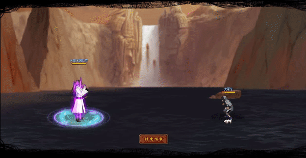

# Otsutsuki Indra

<figure><figcaption></figcaption></figure>

* Lực tay: 30.000 (30%)
* Nhanh nhẹn: 26.000 (26%)
* Tinh thần: 26.000 (26%)
* Thể lực: 310.000 (31%)

### Thiên phú

* Tăng lượng lớn lực tay và thể lực theo phần trăm. Bẩm sinh có 75% tốc độ, 50% tỷ lệ tổn thương và 55% tỷ lệ miễn thương. Khi ninja này lên trận, tăng đồng minh 95% tốc độ, tăng hàng đầu/giữa 30% HP. Giảm hàng giữa/sau quân địch 25% lực công. Khi bị tấn công, 25% xóa hiệu ứng bất lợi phe ta và 40% xóa hiệu ứng bất lợi cho bản thân. Bẩm sinh có 20% S.Bạo. Bỏ qua 40% tỷ lệ thành công khống chế của địch. Miễn dịch Giam Cầm và Giảm Nộ.

### Kỹ năng

* Tấn công tất cả địch với hệ số 300%. Có 80% tỷ lệ gây Giam Cầm địch trong 2 hiệp. Xóa hiệu ứng tăng ích phe địch và giảm địch 50% tỷ lệ hợp kích trong 2 hiệp. Tăng bản thân 50% phòng ngự trong 2 hiệp và tăng phe ta 30% tỷ lệ tổn thương trong 2 hiệp. Tăng bản thân 40% tỷ lệ bạo kích (có thể phá giới hạn) trong 2 hiệp. Hồi bản thân 50 nộ, đồng minh 30 nộ.

| Chi Tiết Hiệu Ứng                                                                                           |
| ----------------------------------------------------------------------------------------------------------- |
| **Giam Cầm:** CC cứng                                                                                       |
| **S.Bạo:** Khi gây sát thương bạo kích, sát thương đó sẽ trừ % HP hiện tại của kẻ địch bằng % S.Bạo sở hữu. |
