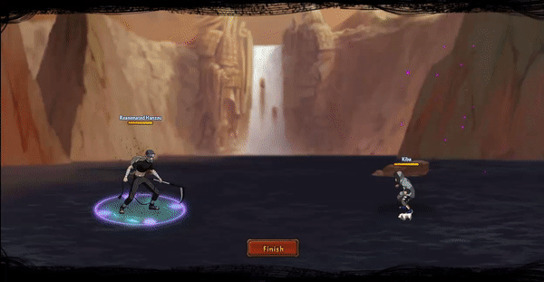

# Reanimated Hanzou

<figure><figcaption></figcaption></figure>

* Lực tay: 40.000 (40%)
* Nhanh nhẹn: 38.000 (38%)
* Tinh thần: 25.000 (25%)
* Thể lực: 420.000 (42%)

### Thiên phú

* Tăng lượng lớn nhạy bén, lực tay và thể lực theo phần trăm. Bẩm sinh có 86% tốc độ, 65% tỷ lệ tổn thương và 65% tỷ lệ miễn thương. Khi ninja này lên trận, tăng đồng minh 112% tốc độ, 30% tỷ lệ miễn thương, 30% HP và miễn giảm 30% sát thương Xuyên Thấu. Tăng đồng minh mang ngũ hành <mark style="color:red;">**Hỏa**</mark>** ** và <mark style="color:blue;">**Thủy**</mark>** ** 30% tỷ lệ tổn thương, 30% lực công và miễn giảm 20% sát thương sau cùng. Giảm toàn quân địch 20% tỷ lệ đỡ đòn và 20% tỷ lệ bạo kích. Bản thân có 55% kháng khống chế và bỏ qua 150% Phản Thương. Miễn dịch Giam Cầm, Băng Phong và Chủng Tử Vong.
* **Thức tỉnh lần 1:** Miễn dịch 50% giảm thủ địch. Sau khi bị tấn công, xóa hiệu ứng bất lợi cho 2 đồng minh bất kỳ.

### Kỹ năng

* Tấn công tất cả kẻ địch hệ số 300%. Áp dụng Độc, Bạo Liệt và Chảy Máu cho toàn quân địch (3 DOT hệ số 120%) và gây Độc Thực trong 2 hiệp. Đưa đồng minh vào trạng thái Bạo Viêm trong 2 hiệp và hồi đồng HP đồng minh hệ số 120%. Xóa toàn quân địch hiệu ứng tăng ích và địch không thể nhận hiệu ứng tăng ích trong 2 hiệp. Hồi bản thân 68 nộ, đồng minh 30 nộ.

| Chi Tiết Hiệu Ứng                                                                                                                                                                   |
| ----------------------------------------------------------------------------------------------------------------------------------------------------------------------------------- |
| **Băng Phong và Giam Cầm:** CC cứng                                                                                                                                                 |
| **Chủng Tử Vong:** Chết ngay lập tức khi đến lượt \[ngoài trừ lượt Hợp Kích (nhưng hợp kích vẫn tính lượt có thể lợi dụng Hợp Kích để giải Chủng Tử Vong)]                          |
| **Độc, Bạo Liệt và Chảy Máu:** DOT mềm                                                                                                                                              |
| **Độc Thực:** Giảm 30% tỷ lệ miễn thương và miễn giảm sát thương sau cùng. Không thể xua tan.                                                                                       |
| **Bạo Viêm:** Tăng 30% tỷ lệ tổn thương và sát thương sau cùng. Không thể xua tan.                                                                                                  |
| **Sát Thương Xuyên Thấu:** Loại sát thương chỉ bị ảnh hưởng bởi Miễn Giảm Sát Thương Xuyên Thấu (tức là miễn thương, phòng thủ, v.v không thể giảm sát thương Xuyên Thấu nhận vào). |
