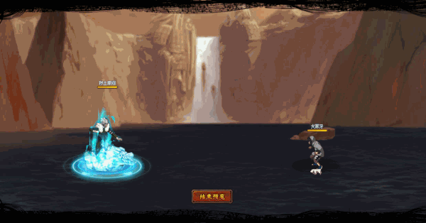

# Tensei Tobirama

<figure><figcaption></figcaption></figure>

* Lực tay: 31.000 (31%)
* Nhanh nhẹn: 28.000 (28%)
* Tinh thần: 28.000 (28%)
* Thể lực: 330.000 (33%)

### Thiên phú

* Tăng lượng lớn lực tay và thể lực theo phần trăm. Bẩm sinh có 78% tốc độ, 55% tỷ lệ tổn thương và 60% tỷ lệ miễn thương. Khi ninja này lên trận, tăng phe ta 100% tốc độ. Giảm hàng giữa/sau đồng minh 40% sát thương sau cùng, bản thân nhận thêm 90% sát thương. Giảm địch 20% lực công. Bẩm sinh tăng bản thân 60% HP và 30% phòng ngự. Khi tấn công, bỏ qua phòng ngự và siêu né. Bản thân có 50% kháng khống chế. Khi bị tấn công hồi HP hệ số 80%. Miễn dịch Băng Phong, Mù và Chủng Tử Vong.
* **Thức tỉnh cấp 1:** Miễn dịch 30% sát thương Xuyên Thấu.

### Kỹ năng

* Tấn công hàng sau địch với hệ số 600%. Giảm địch 300% chính xác trong 2 hiệp. Tăng phe ta 25% tỷ lệ miễn thương trong 2 hiệp, 30% kháng khống chế và tăng hàng sau phe ta 20% tốc độ trong 2 hiệp. Tăng bản thân 30% lực công và 60% tỷ lệ đỡ đòn (có thể phá giới hạn) trong 2 hiệp. Hồi bản thân 68 nộ, đồng đội 30 nộ.
* **Thức tỉnh cấp 1:** Gây thêm sát thương hệ số 200% vào kẻ địch thấp máu nhất.

| Chi Tiết Hiệu Ứng                                                                                                                                                                  |
| ---------------------------------------------------------------------------------------------------------------------------------------------------------------------------------- |
| **Băng Phong và Mù:** CC cứng                                                                                                                                                      |
| **Sát Thương Xuyên Thấu:** Loại sát thương chỉ bị ảnh hưởng bởi Miễn Giảm Sát Thương Xuyên Thấu (tức là miễn thương, phòng thủ, v.v không thể giảm sát thương Xuyên Thấu nhận vào) |
| **Chủng Tử Vong:** Chết ngay lập tức khi đến lượt \[ngoài trừ lượt Hợp Kích (nhưng hợp kích vẫn tính lượt có thể lợi dụng Hợp Kích để giải Chủng Tử Vong)]                         |
