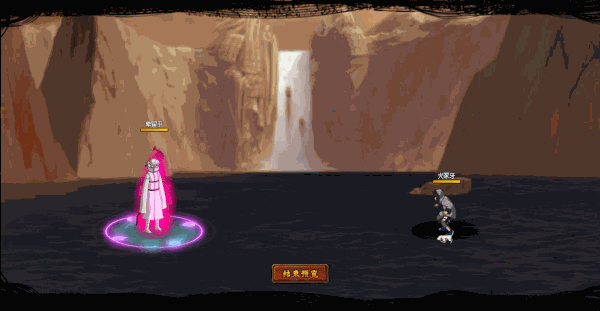

# Hiruko

<figure><figcaption></figcaption></figure>

* Lực tay: 33.000 (32%)
* Nhanh nhẹn: 29.000 (30%)
* Tinh thần: 29.000 (30%)
* Thể lực: 340.000 (34%)

### Thiên phú

* Tăng lượng lớn nhạy bén và lực tay theo phần trăm. Bẩm sinh có 82% tốc độ, 80% tỷ lệ tổn thương và 45% tỷ lệ miễn thương. Khi ninja này lên trận, tăng phe ta 109% tốc độ và 30% HP. Giảm địch 40% tỷ lệ miễn thương. Bẩm sinh tăng 20% phòng ngự cho bản thân. Khi bị tấn công, tăng 100% tốc độ của bản thân trong 2 hiệp và 50% xóa hiệu ứng tăng ích của địch. Bản thân có 50% kháng khống chế và bỏ qua 40% phòng ngự của địch. Bỏ qua Né Nhanh và 150% sát thương phản. Miễn dịch Giảm Nộ và Mù.
* **Thức tỉnh cấp 1:** Tăng sát thương bạo kích bản thân thêm 30%
* **Thức tỉnh cấp 2:** Giảm 15% sát thương sau cùng

### Kỹ năng

* Tấn công hàng đầu/giữa/sau hệ số tương ứng 480%/400%/350%. Tăng phe ta 30% tỷ lệ tổn thương trong 2 hiệp, giảm địch 25 nộ.
* Gây hiệu ứng bất kì (1 trong 2) trong 3 mục\
  – Tăng phe ta 45% bạo kích (ngoại trừ bản thân) (có thể phá giới hạn) trong 2 hiệp hoặc giảm 50% tỷ lệ miễn thương trong 2 hiệp cho 3 địch ngẫu nhiên.\
  – Tăng 500% phòng ngự cho hàng đầu/giữa phe ta trong 2 hiệp hoặc Hỗn Loạn hàng sau địch trong 2 hiệp.\
  – Áp dụng Bạo Liệt (DOT hệ số 100%) lên địch trong 2 hiệp hoặc giảm địch 50% tỷ lệ thành công khống chế trong 2 hiệp.\
  Hồi bản thân 68 nộ, đồng đội 30 nộ.

| Chi Tiết Hiệu Ứng                                              |
| -------------------------------------------------------------- |
| **Hỗn Loạn (CC mềm):** Tấn công đồng minh (Đánh Thường)        |
| **Né Nhanh:** Né toàn bộ sát thương và hiệu ứng. Không thể xóa |
| **Mù:** CC cứng                                                |
| **Bạo Liệt:** DOT mềm                                          |
