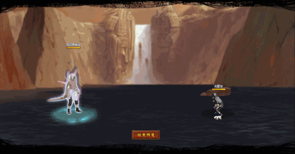

# Kimimaro Chú Ấn

<figure><figcaption></figcaption></figure>

* Lực tay: 30.000 (31%)
* Nhanh nhẹn: 27.000 (28%)
* Tinh thần: 27.000 (28%)
* Thể lực: 320.000 (32%)

### Thiên phú

* Tăng lượng lớn nhạy bén và lực tay theo phần trăm. Bẩm sinh có 80% tốc độ, 60% tỷ lệ tổn thương và 55% tỷ lệ miễn thương. Khi ninja này lên trận, tăng phe ta 98% tốc độ và 30% HP. Giảm địch 35% tỷ lệ miễn thương. Mỗi 10% HP mất, sẽ tăng phe ta 10% tỷ lệ tổn thương. Bản thân có 50% kháng khống chế. Miễn dịch Giảm Nộ, Băng Phong và Tử Vong Chủng.

### Kỹ năng

* Tấn công tất cả địch với hệ số 300%. Có 80% tỷ lệ gây Băng Phong địch trong 2 hiệp, xóa hiệu ứng bất lợi phe ta, gây thêm Sát Thương Xuyên Thấu hệ số 120%. Tăng bản thân 500% phòng ngự trong 2 hiệp. hồi bản thân 50 nộ, đồng đội 30 nộ.

| Chi Tiết Hiệu Ứng                                                                                                                                                                  |
| ---------------------------------------------------------------------------------------------------------------------------------------------------------------------------------- |
| **Chủng Tử Vong:** Chết ngay lập tức khi đến lượt \[ngoài trừ lượt Hợp Kích (nhưng hợp kích vẫn tính lượt có thể lợi dụng Hợp Kích để giải Chủng Tử Vong)]                         |
| **Tê Liệt và Đuổi:** CC mềm                                                                                                                                                        |
| **Băng Phong:** CC cứng                                                                                                                                                            |
| **Sát Thương Xuyên Thấu:** Loại sát thương chỉ bị ảnh hưởng bởi Miễn Giảm Sát Thương Xuyên Thấu (tức là miễn thương, phòng thủ, v.v không thể giảm sát thương Xuyên Thấu nhận vào) |
