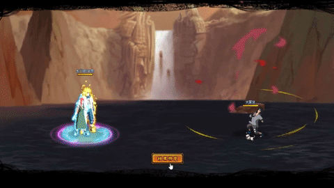

# Minato\&Kushina

<figure><figcaption></figcaption></figure>

* Lực tay: 15.000 (15%)
* Nhanh nhẹn: 14.000 (14%)
* Tinh thần: 14.000 (14%)
* Thể lực: 170.000 (18%)

### Thiên phú

* Tăng lượng lớn nhạy bén và lực tay theo phần trăm. Bẩm sinh có 50% tốc độ, 35% tỷ lệ tổn thương và 40% tỷ lệ miễn thương. Khi ninja này lên trận, giảm quân địch 30% tốc độ và hàng sau quân địch 20% huyễn phòng. Tăng HP của hàng giữa/sau lên 30%. Khi bị tấn công, có 70% xóa hiệu ứng bất lợi của bản thân. Miễn dịch Giảm nộ và Mù.

### Kỹ Năng

* Tấn công tất cả kẻ địch hệ số 300%. Có 60% tỷ lệ gây Thạch Hóa hoặc Cấm Hồi Nộ trong 2 hiệp. Giảm kẻ địch 30% tỷ lệ tổn thương và tỷ lệ cứu viện trong 2 hiệp. Tăng hàng giữa đồng minh 20% lực công và hàng sau đồng minh 15% tốc độ trong 1 hiệp. Xóa hiệu ứng bất lợi 2 đồng minh bất kì và hồi HP hàng sau hệ số 30%. Hồi bản thân 50 nộ, đồng minh 30 nộ.

| Chi Tiết Hiệu Ứng                                                  |
| ------------------------------------------------------------------ |
| **Thạch Hóa (CC mềm):** Không thể hành động, không nhận sát thương |
| **Mù:** CC cứng                                                    |
