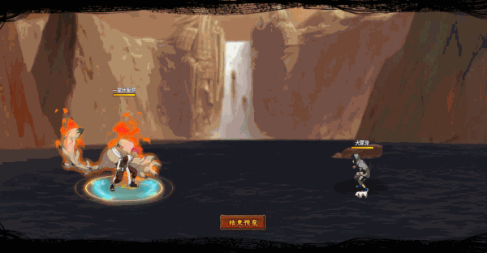

# Nhất Vĩ Garra

<figure><figcaption></figcaption></figure>

* Lực tay: 34.000 (33%)
* Nhanh nhẹn: 29.000 (30%)
* Tinh thần: 29.000 (30%)
* Thể lực: 350.000 (35%)

### Thiên phú

* Tăng lượng lớn lực tay và nhạy bén theo phần trăm. Bẩm sinh có 83% tốc độ, 75% tỷ lệ tổn thương và 50% tỷ lệ miễn thương. Khi lên trận, Tăng phe ta 110% tốc độ, 40% tỷ lệ tổn thương và 30% lực công. Giảm địch 30% thủ. Tăng bản thân 10% lực công và 45% Bạo S. Khi bị tấn công, có 24% vào trạng thái Khiên Cát tăng bản thân 100% phòng thủ trong 1 hiệp, có 8% tỷ lệ gây Hỗn Loạn bản thân trong 1 hiệp. Bỏ qua 50% phe địch tỷ lệ thành công khống chế và 150% phản thương. Miễn dịch Phong Ngục, Giảm Nộ và Tử Vong Chủng.
* **Thức tỉnh cấp 1:** Bẩm sinh có 30% tỷ lệ bạo kích (có thể đột phá giới hạn)
* **Thức tỉnh cấp 2:** Tấn công bỏ qua Siêu Né, Né Nhanh

### Kỹ năng

* Tấn công toàn quân hệ số 350%, thêm sát thương hệ số 200% với địch có máu ít nhất. Có 90% tỷ lệ gây Phong Ngục địch trong 2 hiệp. Giảm phe địch 40% tỷ lệ viện trợ và 30% tỷ lệ miễn thương. Hồi bản thân 50 nộ và đồng đội 30 nộ.

| Chi Tiết Hiệu Ứng                                                                                                                                          |
| ---------------------------------------------------------------------------------------------------------------------------------------------------------- |
| **Chủng Tử Vong:** Chết ngay lập tức khi đến lượt \[ngoài trừ lượt Hợp Kích (nhưng hợp kích vẫn tính lượt có thể lợi dụng Hợp Kích để giải Chủng Tử Vong)] |
| **S.Bạo:** Khi gây bạo kích, trừ máu hiện tại của kẻ địch bàng % S.Bạo sở hữu                                                                              |
| **Tê Liệt và Đuổi:** CC mềm                                                                                                                                |
| **Siêu Né:** Né sát thương. Có thể xóa                                                                                                                     |
| **Né Nhanh:** Né sát thương và hiệu ứng. Không thể xóa                                                                                                     |
