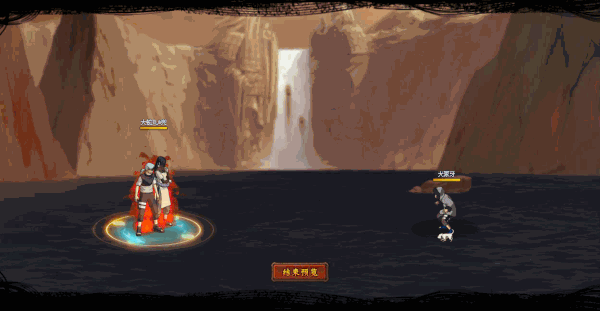

# Orochimaru\&Kabuto

<figure><figcaption></figcaption></figure>

* Lực tay: 32.000 (32%)
* Nhanh nhẹn: 29.000 (29%)
* Tinh thần: 29.000 (29%)
* Thể lực: 330.000 (33%)

### Thiên phú

* Tăng lượng lớn nhạy bén và lực tay theo phần trăm. Bẩm sinh có 80% tốc độ, 65% tỷ lệ tổn thương và 55% tỷ lệ miễn thương. Khi ninja này lên trận, giảm địch 52% tốc độ, tăng phe ta 30% lực công và 30% HP. Mỗi 15% HP mất, giảm địch 5% lực công. Sau khi chết, hồi sinh với 50% HP và xóa tất cả hiệu ứng bất lợi (hồi sinh chỉ kích hoạt 1 lần trong trận đấu). Miễn Khống Chế trong 2 hiệp sau khi hồi sinh. Bản thân có 50% kháng khống chế. Miễn dịch Mù, Chủng Tử Vong và Phản Thương.
* **Thức tỉnh cấp 1:** Sau khi bị tấn công, tăng bản thân 50% phòng thủ
* **Thức tỉnh cấp 2:** Sau khi bị tấn công, 60% tỷ lệ gây Hỗn Loạn kẻ tấn công

### Kỹ năng

* Tấn công hàng đầu/giữa/sau với hệ số tương ứng 500%/400%/330%. Địch có HP cao nhất dính Độc (DOT hệ số 200%) trong 2 hiệp. Khiến địch có HP thấp nhất dính Mù hoặc Giam Cầm trong 2 hiệp. Xóa hiệu quả tăng ích phe địch và cho phe ta miễn dịch 70% Phản Thương. Hồi bản thân 68 nộ và đồng đội 50 nộ.

| Chi Tiết Hiệu Ứng                                                                                                                                          |
| ---------------------------------------------------------------------------------------------------------------------------------------------------------- |
| **Hỗn Loạn (CC mềm):** Tấn công đồng minh (Đánh Thường)                                                                                                    |
| **Độc:** DOT mềm                                                                                                                                           |
| **Mù và Giam Cầm:** CC cứng                                                                                                                                |
| **Chủng Tử Vong:** Chết ngay lập tức khi đến lượt \[ngoài trừ lượt Hợp Kích (nhưng hợp kích vẫn tính lượt có thể lợi dụng Hợp Kích để giải Chủng Tử Vong)] |
