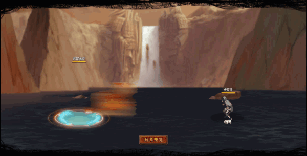

# Roshi Tứ Vĩ

<figure><figcaption></figcaption></figure>

* Lực tay: 34.000 (33%)
* Nhanh nhẹn: 30.000 (31%)
* Tinh thần: 30.000 (31%)
* Thể lực: 350.000 (35%)

### Thiên phú

* Tăng lượng lớn nhanh nhẹn, sức mạnh và thể lực theo phần trăm. Bẩm sinh có 84% tốc độ, 55% tỷ lệ tổn thương và 70% tỷ lệ miễn thương. Khi ninja này lên trận, tăng quân ta 111% tốc độ, 30% HP và 40% tỷ lệ tổn thương. Giảm phe địch 25% lực công và 30% sát thương sau cùng nhận cho tất cả đồng minh. Mỗi 10% HP mất, tăng bản thân 10% phòng thủ và tất cả các đồng minh 10% tỷ lệ miễn thương. Bẩm sinh bỏ qua 50% Khống Chế và 150% Phản Thương. Miễn nhiễm với Giam Cầm và Băng Phong.
* **Thức tỉnh cấp 1**: Khi ninja này ra trận, tăng phòng hàng sau 20%
* **Thức tỉnh cấp 2**: Bỏ qua 30% Sát Thương Xuyên Thấu

### Kỹ năng

* **Tấn công thường**: Tấn công hàng sau kẻ thù hệ số 450%, có 100% tỷ lệ gây hàng sau đối phương vào trạng thái Ý Chí Thống Khổ (không thể nhận hiệu ứng tăng ích) và Thạch Hóa trong 2 hiệp. Giảm hàng sau quân địch 50% tỷ lệ bạo kích, 30% tỷ lệ đỡ đòn, 30% tỷ lệ thành công khống chế và 30% tỷ lệ miễn thương trong 2 hiệp. Tăng bản thân 300% tỷ lệ né tránh và tỷ lệ tổn thương của hàng đầu/sau thêm 60%.
* **Tấn công nộ:** Tấn công tất cả kẻ địch hệ số 320% và áp dụng Bạo Liệt (DOT hệ số 100%) trong 2 hiệp, áp dụng cho kẻ thù HP cao nhất Châm Đốt (DOT hệ số 130%). Xóa hiệu ứng tăng ích của kẻ địch và áp dụng Miễn Khống Chế cho bản thân và hàng đầu đồng minh. Tăng hàng đầu đồng minh 60% lực công trong 2 hiệp, giảm 30% phòng thủ hàng giữa/sau kẻ thù trong 2 hiệp. Hồi bản thân 50 nộ, đồng minh 30 nộ.

| Chi Tiết Hiệu Ứng                                                                                                                                                                  |
| ---------------------------------------------------------------------------------------------------------------------------------------------------------------------------------- |
| **Sát Thương Xuyên Thấu:** Loại sát thương chỉ bị ảnh hưởng bởi Miễn Giảm Sát Thương Xuyên Thấu (tức là miễn thương, phòng thủ, v.v không thể giảm sát thương Xuyên Thấu nhận vào) |
| **Bạo Liệt:** DOT mềm                                                                                                                                                              |
| **Châm Đốt:** DOT mềm                                                                                                                                                              |
| **Giam Cầm và Băng Phong:** CC cứng                                                                                                                                                |
| **Thạch Hóa (CC mềm):** Không thể hành động. Không nhận sát thương                                                                                                                 |
