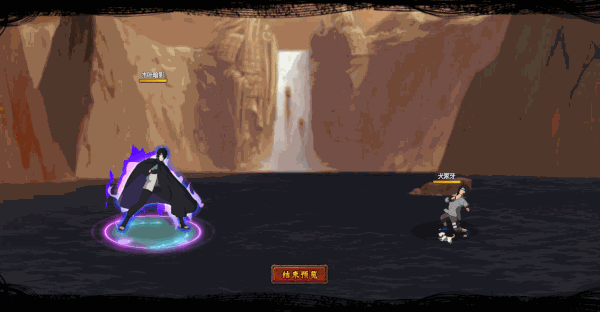

# Shadow Sasuke

<figure><figcaption></figcaption></figure>

* Lực tay: 30.000 (30%)
* Nhanh nhẹn: 27.000 (27%)
* Tinh thần: 27.000 (27%)
* Thể lực: 310.000 (31%)

### Thiên phú

* Tăng lượng lớn nhạy bén và lực tay theo phần trăm. Bẩm sinh có 79% tốc độ, 60% tỷ lệ tổn thương và 50% tỷ lệ miễn thương. Khi ninja này lên trận, giảm địch 49% tốc độ, tăng phe ta 30% lực công và 30% HP. Bản thân có 50% kháng khống chế. Bỏ qua 30% lực công của kẻ địch. Khi bị tấn công, có 80% tỷ lệ gây Choáng kẻ tấn công trong 1 hiệp. Miễn dịch Phản Thương, Mù và Chủng Tử Vong.

### Kỹ Năng

* Tấn công tất cả địch với hệ số 380%. Áp dụng Chảy Máu (DOT hệ số 100%) trong 2 hiệp. Đưa bản thân vào trạng thái Thiên Thủ (bỏ qua tấn công của địch, không thể xua tan) trong 1 hiệp. Giảm địch 20% phòng ngự trong 2 hiệp. Tăng phe ta 60% phá kích (có thể phá giới hạn) trong 2 hiệp. Hồi bản thân 50 nộ, đồng đội 30 nộ.

| Chi Tiết Hiệu Ứng                                                                                                                                          |
| ---------------------------------------------------------------------------------------------------------------------------------------------------------- |
| **Chủng Tử Vong:** Chết ngay lập tức khi đến lượt \[ngoài trừ lượt Hợp Kích (nhưng hợp kích vẫn tính lượt có thể lợi dụng Hợp Kích để giải Chủng Tử Vong)] |
| **Choáng:** CC mềm                                                                                                                                         |
| **Mù:** CC cứng                                                                                                                                            |
| **Chảy Máu:** DOT mềm                                                                                                                                      |
| **Thiên Thủ:** Không nhận sát thương. Không thể xóa                                                                                                        |
