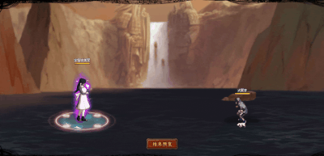

# Uchiha Mikoto

<figure><figcaption></figcaption></figure>

* Lực tay: 40.000 (40%)
* Nhanh nhẹn 38.000 (38%)
* Tinh thần: 27.000 (27%)
* Thể lực: 400.000 (40%)

### Thiên phú

* Tăng lượng lớn nhạy bén, thể lực và lực tay theo phần trăm. Bẩm sinh có 86% tốc độ, 70% tỷ lệ tổn thương và 60% tỷ lệ miễn thương. Khi ninja này lên trận, tăng phe ta 112% tốc độ, 30% HP và lực công, tăng hàng sau phe ta 20% tỷ lệ thành công khống chế, giảm 50% vật phòng của hàng đầu/giữa và 50% huyễn phòng của hàng sau kẻ địch. Khi chết, áp dụng trạng thái Miễn Khống Chế cho 2 đồng minh bất kì trong 2 hiệp, bỏ qua 50% tỷ lệ thành công khống chế, phòng thủ của kẻ địch và 150% Phản Thương. Miễn dịch Giảm Nộ, Mê Hoặc và Mù.
* **Thức tỉnh lần 1**: Tăng bản thân sát thương sau cùng thêm 20%

### Kỹ Năng

* Tấn công tất cả các kẻ thù hệ số 330%, gây thêm sát thương xuyên thấu hệ số 70%, có 90% tỷ lệ gây Phong Ấn và Hỗn Loạn địch trong 2 hiệp, Hồi HP tất cả đồng minh hệ số 100%. Tăng tất cả đồng minh tỷ lệ phá kích 40% trong 2 hiệp (có thể phá vỡ giới hạn), giảm toàn quân địch 30% miễn giảm sát thương cuối và 30% tỷ lệ miễn thương trong 2 hiệp. Hồi bản thân 68 nộ, đồng minh 30 nộ.

| Chi Tiết Hiệu Ứng                                                                                                                                                                  |
| ---------------------------------------------------------------------------------------------------------------------------------------------------------------------------------- |
| **Hỗn Loạn (CC mềm):** Tấn công đồng minh (Đánh Thường)                                                                                                                            |
| **Mê Hoặc:** Tăng 120% tỷ lệ tổn thương và sát thương gây ra. Hỗn Loạn và không thế xua tan.                                                                                       |
| **Mù:** CC cứng                                                                                                                                                                    |
| **Sát Thương Xuyên Thấu:** Loại sát thương chỉ bị ảnh hưởng bởi Miễn Giảm Sát Thương Xuyên Thấu (tức là miễn thương, phòng thủ, v.v không thể giảm sát thương Xuyên Thấu nhận vào) |
| **Phong Ấn (CC cứng):** Không thể tung kỹ năng                                                                                                                                     |
