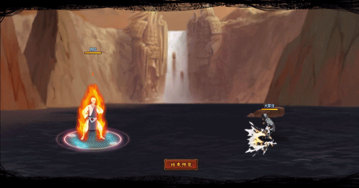

# Chiriku

<figure><figcaption></figcaption></figure>

* Lực tay: 24.000 (24%)
* Nhanh nhẹn: 27.000 (27%)
* Tinh thần: 27.000 (27%)
* Thể lực: 280.000 (28%)

### Thiên phú

* Tăng lượng lớn nhạy bén và tinh thần theo phần trăm. Bẩm sinh có 76% tốc độ, 50% tỷ lệ tổn thương và 50% tỷ lệ miễn thương. Khi ninja này lên trận, giảm quân địch 47% tốc độ của và 20% phòng thủ, Tăng đồng minh 20% lực công. Miễn dịch 110% sát thương phản. Khi bị tấn công, có 50% tỷ lệ để xóa tất cả hiệu ứng bất lợi trên bản thân. Miễn nhiễm Mù và Hỗn Loạn.

### Kỹ Năng

* Tấn công tất cả kẻ địch hệ số 330%. Có 100% tỷ lệ gây Hỗn Loạn kẻ địch trong 2 hiệp. Tăng bản thân 500% phòng thủ trong 1 hiệp, giảm hàng giữa/sau kẻ địch 20% tỷ lệ tổn thương trong 2 hiệp. Tăng hàng giữa/sau đồng minh 40% tỷ lệ khống chế thành công khống chế và toàn quân ta 90% tỷ lệ chính xác trong 2 hiệp. Hồi bản thân 68 nộ, đồng minh 30 nộ.

| Chi Tiết Hiệu Ứng                                       |
| ------------------------------------------------------- |
| **Hỗn Loạn (CC mềm):** Tấn công đồng minh (Đánh Thường) |
| **Mù:** CC cứng                                         |
