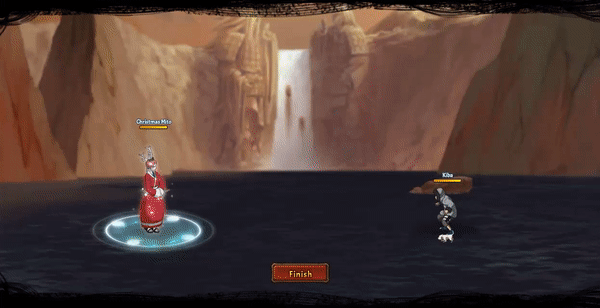

# Christmas Mito

<figure><figcaption></figcaption></figure>

* Lực tay: 25.000 (25%)
* Nhanh nhẹn: 40.000 (40%)
* Tinh thần: 38.000 (38%)
* Thể lực: 420.000 (42%)

### Thiên phú

* Tăng lượng lớn tinh thần, nhạy bén và lực tay theo phần trăm. Bẩm sinh có 92% tốc độ, 65% tỷ lệ tổn thương và 65% tỷ lệ miễn thương. Khi ninja này lên trận tăng toàn quân 116% tốc độ, 35% HP và 30% lực công. Giảm toàn quân địch 30% lực công. Giảm quân địch mang ngũ hành **Hỏa**, **Phong**, **Thổ** 15% kháng khống chế và tỷ lệ thành công khống chế. Bản thân tăng thêm 30% HP, bỏ qua địch 10% lực công và 150% Phản Thương. Đánh bỏ qua Siêu Né. Miễn nhiễm Tử Vong Chủng, Hỗn Loạn và Mê Hoặc.
* **Thức tỉnh lần 1:** Tăng bản thân 20% phòng thủ và 30% tỷ lệ đỡ đòn (có thể vượt giới hạn)

### Kỹ năng

* **Đánh Thường:** Tấn công tất cả kẻ địch hệ số 350%. Đưa hàng đầu đồng minh vài trạng thái Miễn Khống Chế trong 2 hiệp và có 50% tỷ lệ đưa hàng sau đồng minh vào trạng thái Miễn Khống Chế trong 2 hiệp. Khiến 1 kẻ địch bất kỳ vào trạng thái Giam Cầm trong 2 hiệp. Khiến 2 kẻ địch bất kỳ và trạng thái Nghịch Phong trong 2 hiệp và giải hiệu ứng bất lợi cho 2 đồng minh bất kỳ. Có 110% tỷ lệ gây Hỗn Loạn cho hàng đầu phe địch. Hồi đồng minh HP hệ số 100%.
* **Kỹ năng nộ:** Tấn công tất cả kẻ địch hệ số 300%, đưa tất cả đồng minh vào trạng thái Phá Phong trong 4 hiệp. Xóa hiệu ứng tăng ích của toàn quân địch.

| Chi Tiết Hiệu Ứng                                                                                                                                          |
| ---------------------------------------------------------------------------------------------------------------------------------------------------------- |
| **Hỗn Loạn (CC mềm):** Tấn công đồng minh (Đánh Thường)                                                                                                    |
| **Mê Hoặc:** Tăng 120% tỷ lệ tổn thương và sát thương gây ra. Hỗn Loạn và không thế xua tan.                                                               |
| **Chủng Tử Vong:** Chết ngay lập tức khi đến lượt \[ngoài trừ lượt Hợp Kích (nhưng hợp kích vẫn tính lượt có thể lợi dụng Hợp Kích để giải Chủng Tử Vong)] |
| **Nghịch Phong:** Giảm 30% Kháng Khống Chế và hệ số Hồi Phục. Không thể xua tan                                                                            |
| **Giam Cầm:** CC cứng                                                                                                                                      |
| **Phá Phong:** Tăng 30% lực công và phòng thủ. Không thể xua tan.                                                                                          |
