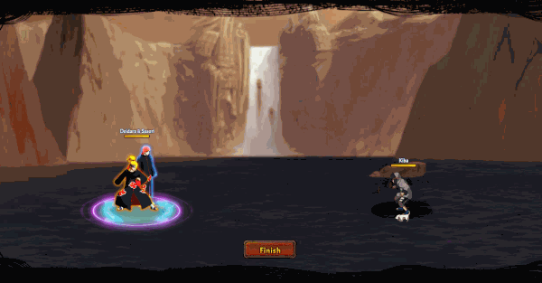

# Deidara\&Sasori

<figure><figcaption></figcaption></figure>

* Lực tay: 14.000 (12%)
* Nhanh nhẹn: 15.000 (13%)
* Tinh thần: 15.000 (13%)
* Thể lực: 120.000 (15%)

### Thiên phú

* Tăng lượng lớn nhạy bén và tinh thần theo phần trăm. Bẩm sinh có 50% tốc độ, 35% tỷ lệ tổn thương và 35% tỷ lệ miễn thương. Khi ninja này lên trận, tăng đồng minh 35% tốc độ, tăng HP của hàng giữa/đầu thêm 50% và giảm hàng sau kẻ địch 35% lực công. Khi ninja này chết, ngẫu nhiên áp dụng Tử Vong Chủng cho 1 kẻ địch và 50% áp dụng Tử Vong Chủng cho kẻ địch khác. Khi bị tấn công, có 80% tỷ lệ Choáng kẻ tấn công trong 1 hiệp. Miễn nhiễm Giảm Nộ và Hỗn Loạn.

### Kỹ Năng

* Tấn công tất cả kẻ thù với hệ số 300%. Giảm kẻ địch 50 điểm nộ, áp dụng Siêu Né cho hàng đầu đồng minh trong 1 hiệp. Giảm kẻ địch 20% tỷ lệ hợp kích và tỷ lệ cứu viện trong 1 hiệp. Giảm khả năng hồi phục của kẻ thù đi 70% trong 2 hiệp. Hồi bản thân 68 nộ, đồng minh 50 nộ.

| Chi Tiết Hiệu Ứng                                                                                                                                          |
| ---------------------------------------------------------------------------------------------------------------------------------------------------------- |
| **Hỗn Loạn (CC mềm):** Tấn công đồng minh (Đánh Thường)                                                                                                    |
| **Chủng Tử Vong:** Chết ngay lập tức khi đến lượt \[ngoài trừ lượt Hợp Kích (nhưng hợp kích vẫn tính lượt có thể lợi dụng Hợp Kích để giải Chủng Tử Vong)] |
