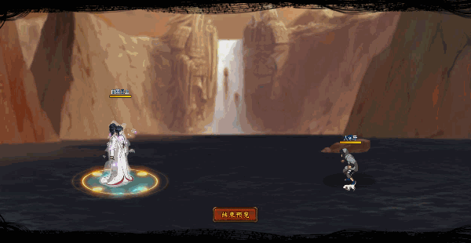

# Hinata Công Chúa

<figure><figcaption></figcaption></figure>

* Lực tay: 29.000 (28%)
* Nhanh nhẹn: 34.000 (35%)
* Tinh thần: 34.000 (35%)
* Thể lực: 350.000 (34%)

### Thiên phú

* Tăng lượng lớn nhạy bén và tinh thần theo phần trăm. Bẩm sinh có 86% tốc độ, 70% tỷ lệ tổn thương và 55% tỷ lệ miễn thương. Khi ninja này lên trận tăng phe ta 110% tốc độ và 25% kháng khống chế, tăng tỷ lệ tổn thương 50%/30%/30% tương ứng hàng đầu/giữa/sau. Giảm hàng đầu đồng minh 45% sát thương sau cùng. Tăng 15% lực công cho bản thân. Bỏ qua Siêu Né và 120% phản thương. Miễn dịch Mù và Giam Cầm.
* **Thức tỉnh cấp 1:** Tăng toàn quân bên ta 20% phòng ngự
* **Thức tỉnh cấp 2:** Tăng ninja nam bên ta 20% lực công, giảm ninja nam bên địch 30% lực công

### Kỹ năng

* Tấn công tất cả địch hệ số 330%. Có 90% tỷ lệ gây khống chế địch trong 2 hiệp (Giam Cầm hoặc Mù và Điểm Huyệt hoặc Choáng). Gây thêm 65% sát thương xuyên thấu. Tăng phe ta 50% tỉ lệ thành công khống chế. Giảm địch 30% lực công. Hồi 100 nộ cho bản thân và 30 nộ cho đồng đội.

| Chi Tiết Hiệu Ứng                                                                                                                                                                  |
| ---------------------------------------------------------------------------------------------------------------------------------------------------------------------------------- |
| **Siêu Né:** Né sát thương. Có thể xóa                                                                                                                                             |
| **Điểm Huyệt và Choáng:** CC mềm                                                                                                                                                   |
| **Mù và Giam Cầm:** CC cứng                                                                                                                                                        |
| **Sát Thương Xuyên Thấu:** Loại sát thương chỉ bị ảnh hưởng bởi Miễn Giảm Sát Thương Xuyên Thấu (tức là miễn thương, phòng thủ, v.v không thể giảm sát thương Xuyên Thấu nhận vào) |
