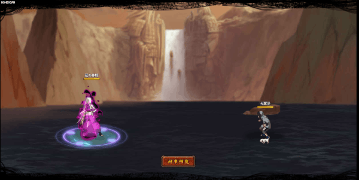

# Ino

<figure><figcaption></figcaption></figure>

* Lực tay: 27.000 (27%)
* Nhanh nhẹn: 32.000 (32%)
* Tinh thần: 32.000 (32%)
* Thể lực: 330.000 (33%)

### Thiên phú

* Tăng lượng lớn nhạy bén và tinh thần theo phần trăm. Bẩm sinh có 84% tốc độ, 60% tỷ lệ tổn thương và 55% tỷ lệ miễn thương. Khi ninja này lên trận, tăng phe ta 102% tốc độ và 25% HP. Giảm địch 20% tỷ lệ tổn thương. Khi bị tấn công, có 35% xóa hiệu ứng bất lợi cho bản thân, 50% xóa hiệu ứng bất lợi cho phe ta và có 80% tỷ lệ gây Mù hoặc Giam Cầm địch và 100% tỷ lệ Hỗn Loạn hoặc Nguyền Rủa địch trong 2 hiệp. Miễn dịch Mù và Băng Phong.
* **Thức tỉnh cấp 1:** Tăng bản thân 10% tỷ lệ hợp kích và tỷ lệ cứu viện
* **Thức tỉnh cấp 2:** Khi bị tấn công, có 50% xóa hiệu ứng xấu bản thân

### Kỹ năng

* Tấn công địch có HP thấp nhất và 2 địch ngẫu nhiên với hệ số 400%. Hồi phe ta HP hệ số 150% (trừ bản thân). Có 55% tỷ lệ áp dụng Né Nhanh cho tối đa 3 đồng minh (trừ bản thân) trong 2 hiệp, hàng giữa/sau địch không thể nhận hiệu ứng tăng ích, giảm địch 30% lực công và phòng thủ trong 2 hiệp. Hồi bản thân 68 nộ, đồng đội 30 nộ.

| Chi Tiết Hiệu Ứng                                       |
| ------------------------------------------------------- |
| **Hỗn Loạn (CC mềm):** Tấn công đồng minh (Đánh Thường) |
| **Nguyền Rủa:** CC mềm                                  |
| **Mù và Giam Cầm:** CC cứng                             |
| **Né Nhanh:** Né sát thương và hiệu ứng, không thể xóa  |
