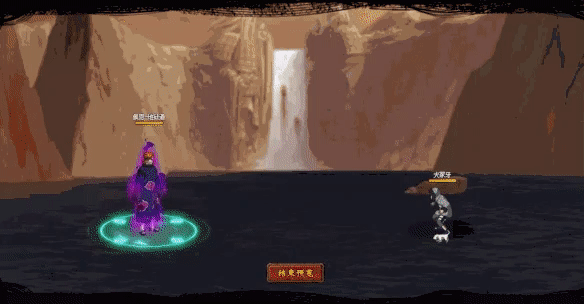

# Jigokudo

<figure><figcaption></figcaption></figure>

* Lực tay: 29.000 (29%)
* Nhanh nhẹn: 35.000 (35%)
* Tinh thần: 35.000 (35%)
* Thể lực: 350.000 (35%)

### Thiên phú

* Tăng lượng lớn nhạy bén và tinh thần theo phần trăm. Bẩm sinh có 87% tốc độ, 55% tỷ lệ tổn thương và 70% tỷ lệ miễn thương. Khi ninja này lên trận, tăng phe ta 112% tốc độ, 30% tỷ lệ miễn thương và HP. Giảm hàng giữa/sau địch 30% tỷ lệ tổn thương. Khi bị tấn công, nếu máu lớn hơn kẻ tấn công tăng phòng thủ hàng sau thêm 120%, nếu máu thấp hơn kẻ tấn công tăng bản thân 40% tỷ lệ miễn thương. Khi bị tấn công, hồi máu toàn quân hệ số 50%. Miễn dịch Hỗn Loạn, Mù và Tử Vong Chủng.
* **Thức tỉnh cấp 1:** Khi ra trận, tăng khả năng hồi phục toàn đội thêm 30%
* **Thức tỉnh cấp 2:** Khi chết, 85% áp dụng Chủng Tử Vong cho 1 địch, 15% áp dụng Chủng Tử Vong cho 2 địch.

### Kỹ năng

* Tấn công toàn quân địch với hệ số 280%. Có 100% tỷ lệ gây Hỗn Loạn, Cấm Kỹ và Mù kẻ địch trong 2 hiệp, giảm hàng giữa địch 100 nộ và xóa hiệu ứng tăng ích của địch. Giảm toàn quân địch 30% tỷ lệ khống chế trong 2 hiệp. Tăng hàng giữa/sau phe ta 40% tỷ lệ hợp kích và 30% lực công trong 2 hiệp. Hồi bản thân 68 nô và đồng đội 30 nộ.

| Chi Tiết Hiệu Ứng                                                                                                                                          |
| ---------------------------------------------------------------------------------------------------------------------------------------------------------- |
| **Hỗn Loạn (CC mềm):** Tấn công đồng minh (Đánh Thường)                                                                                                    |
| **Chủng Tử Vong:** Chết ngay lập tức khi đến lượt \[ngoài trừ lượt Hợp Kích (nhưng hợp kích vẫn tính lượt có thể lợi dụng Hợp Kích để giải Chủng Tử Vong)] |
| **Mù:** CC cứng                                                                                                                                            |
| **Cấm Kỹ (CC mềm):** Không thể tung kỹ năng                                                                                                                |
