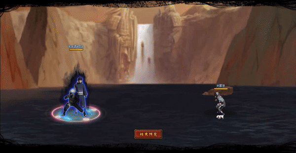

# Kakashi\&Obito

<figure><figcaption></figcaption></figure>

* Lực tay: 20.000 (20%)
* Nhanh nhẹn: 23.000 (23%)
* Tinh thần: 23.000 (23%)
* Thể lực: 240.000 (24%)

### Thiên phú

* Tăng lượng lớn nhạy bén và tinh thần theo tỷ lệ phần trăm. Bẩm sinh có 70% tốc độ, 50% tỷ lệ tổn thương và 50% tỷ lệ miễn thương. Khi ninja này lên trận, tăng đồng minh 70% tốc độ và hàng sau đồng minh 20% lực công, giảm quân địch 30% tỷ lệ miễn thương. Khi bị tấn công, phản sát thương hệ số 120%. Miễn dịch với Băng Phong và Chủng Tử Vong

### Kỹ Năng

* Tấn công tất cả kẻ địch hệ số 330%. Có 60% tỷ lệ gây Băng Phong và Hỗn Loạn kẻ thù trong 2 vòng. Ngẫu nhiên khiến 3 kẻ thù vào trạng thái Đau Khổ Ý Chí (không thể nhận hiệu ứng tăng ích) trong 2 hiệp. Tăng đồng minh 30% tỷ lệ tổn thương trong 2 hiệp, giảm phe địch 50% tỷ lệ hợp kích trong 2 hiệp. Hồi bản thân 50 nộ, đồng minh 30 nộ.

| Chi Tiết Hiệu Ứng                                                                                                                                          |
| ---------------------------------------------------------------------------------------------------------------------------------------------------------- |
| **Hỗn Loạn (CC mềm):** Tấn công đồng minh (Đánh Thường)                                                                                                    |
| **Chủng Tử Vong:** Chết ngay lập tức khi đến lượt \[ngoài trừ lượt Hợp Kích (nhưng hợp kích vẫn tính lượt có thể lợi dụng Hợp Kích để giải Chủng Tử Vong)] |
| **Băng Phong:** CC cứng                                                                                                                                    |
