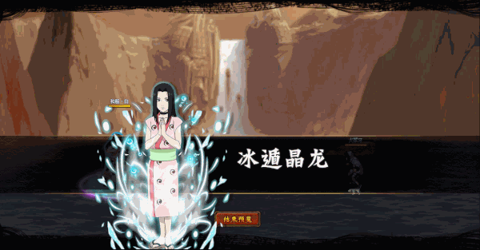

# Kimono Haku (Xmas Haku)

<figure><figcaption></figcaption></figure>

<figure><figcaption></figcaption></figure>

* Lực tay: 25.000 (25%)
* Nhanh nhẹn: 28.000 (28%)
* Tinh thần: 30.000 (30%)
* Thể lực: 300.000 (30%)

### Thiên phú

* Tăng lượng lớn nhạy bén và tinh thần theo phần trăm. Bẩm sinh có 78% tốc độ, 55% tỷ lệ tổn thương và 50% tỷ lệ miễn thương. Khi ninja này lên trận, tăng đồng minh 93% tốc độ và HP hàng sau đồng minh thêm 20%, giảm quân địch 25% tỷ lệ miễn thương. Khi bị tấn công, gây Độc kẻ thù (DOT hệ số 120%) trong 1 hiệp. Bỏ qua Siêu Né và Né Nhanh. Miễn nhiễm với Hỗn Loạn và Băng Phong.

### Kỹ năng

* Tấn công tất cả kẻ thù với hệ số 330%. Có 80% tỷ lệ gây Băng Phong kẻ thù trong 2 hiệp và xóa hiệu ứng tăng ích kẻ thù. Giảm kẻ địch 25% tỷ lệ tổn thương và hàng giữa quân địch 30% phòng thủ trong 2 hiệp. Giảm 80% sát thương phản đồng minh nhận vào và tăng đồng minh 25% lực công trong 2 hiệp. Hồi bản thân 50 nộ, đồng minh 30 nộ.

| Chi Tiết Hiệu Ứng                                       |
| ------------------------------------------------------- |
| **Hỗn Loạn (CC mềm):** Tấn công đồng minh (Đánh Thường) |
| **Băng Phong:** CC cứng                                 |
| **Siêu Né:** Né sát thương. Có thể xóa                  |
| **Né Nhanh:** Né sát thương và hiệu ứng. Không thể xóa  |
