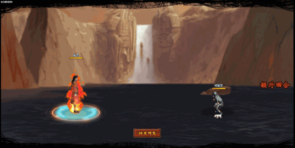

# MUI

<figure><figcaption></figcaption></figure>

* Lực tay: 28.000 (28%)
* Nhanh nhẹn: 34.000 (34%)
* Tinh thần: 34.000 (34%)
* Thể lực: 340.000 (34%)

### Thiên phú

* Tăng lượng lớn nhạy bén và tinh thần theo phần trăm. Bẩm sinh có 85% tốc độ, 30% tỷ lệ tổn thương và 80% tỷ lệ miễn thương. Khi ninja này lên trận, tăng phe ta 104% tốc độ, tăng tỷ lệ miễn thương phe ta 55%/40%/40% tương ứng với hàng đầu/giữa/sau. Giảm địch 25% lực công. Khi bị tấn công, 100% gây khống chế tướng tấn công (Choáng hoặc Cấm Kỹ+Nguyền Rủa hoặc Tê Liệt+Cấm Hồi Nộ hoặc Sốc) trong 2 hiệp. Miễn dịch Giam Cầm, Giảm Nộ và Phong Ngục.
* **Thức tỉnh cấp 1:** Tăng bản thân thêm 10% tỷ lệ tổn thương

### Kỹ năng

* Tấn công tất cả địch với hệ số 120%. Khiến địch vào trạng thái Châm Đốt (DOT hệ số 80%) trong 2 hiệp và trạng thái Phẫn Diệt (DOT hệ số 100%) trong 2 hiệp. Có 100% tỷ lệ gây Giam Cầm và Cấm Kỹ hàng sau địch trong 2 hiệp. Khiến hàng đầu kẻ địch dính Cấm Hồi Phục. Giảm hàng giữa địch 50% phòng ngự trong 2 hiệp. Tăng phe ta 30% lực công và 20% tỷ lệ miễn thương. Hồi bản thân 68 nộ, đồng đội 30 nộ.
* **Thức tỉnh cấp 1:** Tăng hệ số kỹ năng thêm 60%.

| Chi Tiết Hiệu Ứng                              |
| ---------------------------------------------- |
| **Cấm Kỹ (CC mềm):** Không thể tung kỹ năng    |
| **Choáng, Nguyền Rủa, Tê Liệt và Sốc:** CC mềm |
| **Giam Cầm và Phong Ngục:** CC cứng            |
| **Châm Đốt:** DOT mềm                          |
| **Phẫn Diệt:** DOT cứng                        |
