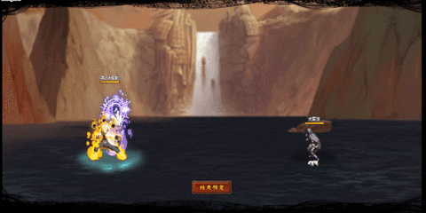

# Naruto\&Sasuke

<figure><figcaption></figcaption></figure>

* Lực tay: 13.000 (13%)
* Nhanh nhẹn: 15.000 (14.5%)
* Tinh thần: 16.000 (14.5%)
* Thể lực: 180.000 (17%)

### Thiên phú

* Tăng lượng lớn nhạy bén và tinh thần theo phần trăm. Bẩm sinh có 55% tốc độ, 40% tỷ lệ tổn thương và 40% tỷ lệ miễn thương. Khi ninja này lên trận, tăng đồng minh 40% tốc độ và 30% HP, tăng hàng sau đồng minh 15% lực công và hàng giữa đồng minh 30% tỷ lệ miễn thương. Với mỗi 10% HP mất, tăng bản thân 3% tỷ lệ tổn thương. Miễn dịch Nguyền Rủa và Điểm Huyệt.

### Kỹ Năng

* Tấn công tất cả kẻ địch hệ số 300%. Có 60% tỷ lệ gây Điểm Huyệt và Choáng kẻ địch trong 2 hiệp. Tăng hàng giữa đồng minh 25% tốc độ, 10% tỷ lệ tổn thương và 30% tỷ lệ thành công kỹ năng khống chế trong 2 hiệp. Giảm kẻ địch 20% vật phòng và hàng sau kẻ địch 30% huyễn phòng trong 2 hiệp. Hồi bản thân 68 nộ, đồng minh 30 nộ.

| Chi Tiết Hiệu Ứng                            |
| -------------------------------------------- |
| **Nguyền Rủa, Choáng và Điểm Huyệt:** CC mềm |
