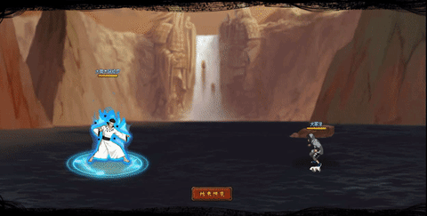

# Otsutsuki Ashura

<figure><figcaption></figcaption></figure>

* Lực tay: 25.000 (25%)
* Nhanh nhẹn: 30.000 (30%)
* Tinh thần: 30.000 (30%)
* Thể lực: 290.000 (29%)

### Thiên phú

* Tăng lương lớn nhạy bén và tinh thần theo tỷ lệ phần trăm. Bẩm sinh có 79% tốc độ, 55% tỷ lệ tổn thương và 55% tỷ lệ miễn thương. Khi ninja này lên trận, tăng phe ta 96% tốc độ và 20% kháng khống chế. Giảm hàng giữa/sau địch 20% phòng thủ. Khi bị tấn công, hồi HP phe ta hệ số 40%. Miễn dịch 150% Phản Thương. Miễn dịch Giam Cầm, Mù và Chủng Tử Vong.

### Kỹ năng

* Tấn công tất cả địch với hệ số 300%. Có 80% tỷ lệ gây Giam Cầm hoặc Mù địch trong 2 hiệp. Có 30% đưa bản thân vào trạng thái Phong Độn trong 2 hiệp. Giảm địch 50% kháng bạo trong 2 hiệp. Tăng phe ta 40% tỷ lệ tổn thương trong 2 hiệp. Hồi bản thân 68 nộ, đồng đội 30 nộ.

| Chi Tiết Hiệu Ứng                                                                                                                                          |
| ---------------------------------------------------------------------------------------------------------------------------------------------------------- |
| **Chủng Tử Vong:** Chết ngay lập tức khi đến lượt \[ngoài trừ lượt Hợp Kích (nhưng hợp kích vẫn tính lượt có thể lợi dụng Hợp Kích để giải Chủng Tử Vong)] |
| **Phong Độn:** Chỉ nhận vào 30% sát thương. Không thể xóa                                                                                                  |
| **Giam Cầm và Mù:** CC cứng                                                                                                                                |
