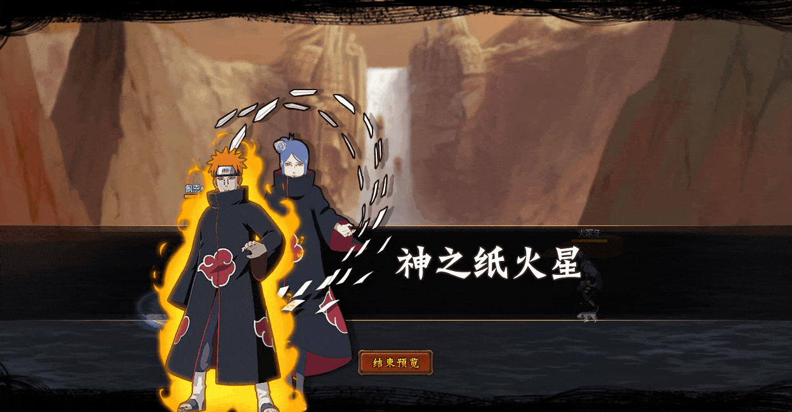

# Pain\&Konan

<figure><figcaption></figcaption></figure>

* Lực tay: 12.000 (10.5%)
* Nhanh nhẹn: 14000 (12%)
* Tinh thần: 14000 (12%)
* Thể lực: 100.000 (13%)

### Thiên phú

* Tăng lượng lớn nhạy bén và tinh thần theo phần trăm (40%). Bẩm sinh có 48% tốc độ, 30% tỷ lệ miễn thương và 30% tỷ lệ tổn thương. Khi ninja này lên trận, tăng toàn quân ta 35% tốc độ và hàng sau đồng minh 15% tỷ lệ tổn thương. Miễn dịch Tê Liệt và Choáng.

### Kỹ Năng

* Tấn công tất cả kẻ địch hệ số 300%. Có 60% tỷ lệ gây Mù kẻ địch trong 2 Hiệp. Áp dụng Châm Đốt (DOT hệ số 130%) trong 1 hiệp. Áp dụng Miễn Choáng cho hàng giữa đồng minh trong 2 hiệp. Tăng hàng giữa đồng minh 15% tốc độ và 20% huyễn phòng trong 1 hiệp. Hồi bản thân 60 nộ, đồng minh 30 nộ.

| Chi Tiết Hiệu Ứng             |
| ----------------------------- |
| **Châm Đốt:** DOT mềm         |
| **Tê Liệt và Choáng:** CC mềm |
| **Mù:** CC cứng               |
