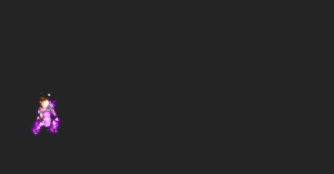

# Sakon Ukon

<figure><figcaption></figcaption></figure>

* Lực tay: 30000 (30%)
* Nhanh nhẹn: 38000 (38%)
* Tinh thần: 37000 (32%)
* Thể lực: 450000 (45%)

### Thiên phú

* Tăng lượng lớn nhạy bén, tinh thần và thể lực theo phần trăm. Bẩm sinh có 92% tốc độ, 65% tỷ lệ tổn thương và 65% tỷ lệ miễn thương. Khi lên trận, tăng toàn quân ta 116% tốc độ, 40% tỷ lệ miễn thương và 30% HP. Tăng đồng minh mang ngũ hành <mark style="color:red;">**Hỏa**</mark>** ** lực công lên 50%, tăng đồng minh mang ngũ hành <mark style="color:orange;">**Thổ**</mark>** ** 60% song phòng và miễn giảm 30% sát thương sau cùng. Giảm toàn quân địch 30% tỷ lệ tổn thương và giảm kẻ địch mang ngũ hành <mark style="color:green;">**Phong**</mark>** ** 30% tỷ lệ thành công khống chế. Giảm kẻ địch mang ngũ hành <mark style="color:red;">**Hỏa**</mark>** ** 50% lực công. Khi bị tấn công, có 40% đưa đồng minh mang ngũ hành <mark style="color:orange;">**Thổ**</mark>** ** vào trạng thái Miễn Khống Chế trong 2 hiệp. Bản thân bỏ qua 150% phản thương. Miễn dịch Phong Ấn, Mê Hoặc và Chủng Tử Vong.

### Kỹ năng

* Tấn công toàn quân địch hệ số 300%. Có 100% tỷ lệ gây cho kẻ địch mang ngũ hành <mark style="color:red;">**Hỏa**</mark>** ** và ngũ hành <mark style="color:green;">**Phong**</mark> vào trạng thái Phong Ấn trong 2 hiệp, Đưa đồng minh mang ngũ hành <mark style="color:red;">**Hỏa**</mark>** ** vào trạng thái Phá Phong trong 2 hiệp. Giảm toàn quân địch 30% sát thương sau cùng và giảm kẻ địch mang ngũ hành <mark style="color:red;">**Hỏa**</mark>** ** 40% lực công. Hồi bản thân 68 nộ và đồng minh 30 nộ.
* **Thức Tỉnh Lần 1:** Sau khi sử dụng kỹ năng. Gây cho kẻ địch ngũ hành <mark style="color:green;">**Phong**</mark>** ** Châm Đốt (DOT) hệ số 150%. Đồng thời gây thêm cho kẻ địch mang ngũ hành <mark style="color:red;">**Hỏa**</mark>** ** sát thương hệ số 300%.

| Chi Tiết Hiệu Ứng                                                                                                                                          |
| ---------------------------------------------------------------------------------------------------------------------------------------------------------- |
| **Chủng Tử Vong:** Chết ngay lập tức khi đến lượt \[ngoài trừ lượt Hợp Kích (nhưng hợp kích vẫn tính lượt có thể lợi dụng Hợp Kích để giải Chủng Tử Vong)] |
| **Phong Ấn (CC cứng):** Không thể tung kỹ năng                                                                                                             |
| **Mê Hoặc:** Tăng 120% tỷ lệ tổn thương và sát thương gây ra. Hỗn Loạn và không thế xua tan.                                                               |
| **Phá Phong:** Tăng 30% lực công và phòng thủ. Không thể xua tan                                                                                           |
| **Châm Đốt:** DOT mềm                                                                                                                                      |
