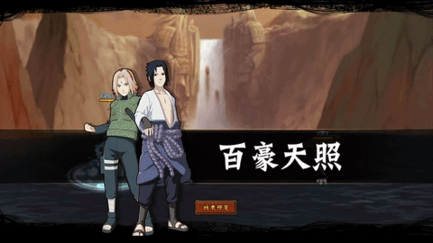

# Sasuke\&Sakura

<figure><figcaption></figcaption></figure>

* Lực tay: 14.000 (13%)
* Nhanh nhẹn: 16.000 (14%)
* Tinh thần: 16.000 (14%)
* Thể lực: 150.000 (17%)

### Thiên phú

* Tăng lượng lớn nhạy bén và tinh thần theo phần trăm. Bẩm sinh có 50% tốc độ, 40% tỷ lệ tổn thương và 35% tỷ lệ miễn thương. Khi ninja này lên trận, tăng đồng minh 35% tốc độ, 15% tỷ lệ tổn thương và 10% tỷ lệ miễn thương thêm. Khi bị tấn công, có 80% tỷ lệ gây Nguyền Rủa kẻ tấn công và hồi bản thân 100 nộ. Miễn nhiễm với Mù và Hỗn Loạn.

### Kỹ Năng

* Tấn công tất cả kẻ địch hệ số 300%. Có 60% tỷ lệ gây Nguyền Rủa và Cấm Kỹ kẻ địch trong 2 hiệp. Giảm kẻ địch 30% tỷ lệ cứu viện trong 2 hiệp và 20% phòng thủ trong 1 hiệp. Tăng hàng giữa đồng minh 25% phòng thủ và tỷ lệ miễn thưởng trong 1 hiệp. Hồi HP đồng minh hệ số 150%. Hồi bản thân 50 nộ, đồng minh 30 nộ.

| Chi Tiết Hiệu Ứng                                       |
| ------------------------------------------------------- |
| **Hỗn Loạn (CC mềm):** Tấn công đồng minh (Đánh Thường) |
| **Cấm Kỹ (CC mềm):** Không thể tung kỹ năng             |
| **Nguyền Rủa:** CC mềm                                  |
| **Mù:** CC cứng                                         |
