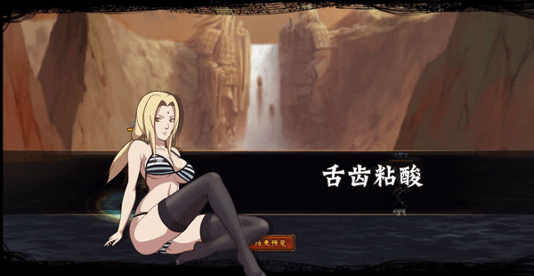

# Swimsuit Tsunade

<figure><figcaption></figcaption></figure>

* Lực tay: 24.000 (24%)
* Nhanh nhẹn: 26.000 (26%)
* Tinh thần: 26.000 (26%)
* Thể lực: 280.000 (28%)

### Thiên phú

* Tăng lượng lớn nhạy bén và tinh thần theo phần trăm. Bẩm sinh có 75% tốc độ, 50% tỷ lệ tổn thương và 50% tỷ lệ miễn thương. Khi ninja này lên trận, tăng đồng minh 85% tốc độ đồng minh. Giảm quân địch 20% tỷ lệ miễn thương. Khi bị tấn công, có 50% tỷ lệ để để xóa hiệu ứng bất lợi bản thân. Khi chết, xóa hiệu ứng bất lợi cho đồng minh. Miễn dịch với Mù, Choáng và Chủng Tử Vong.

### Kỹ Năng

* Tấn công tất cả kẻ địch với hệ số 300%. Có 70% tỷ lệ gây Mù và Choáng kẻ địch trong 2 hiệp, tăng hàng giữa đồng minh 30% phòng thủ và tất cả đồng minh 30% tỷ lệ miễn thương. Giảm kẻ địch khả năng hồi phục đi 100% trong 2 hiệp. Hồi bản thân 50 nộ, đồng minh 30 nộ.

| Chi Tiết Hiệu Ứng                                                                                                                                          |
| ---------------------------------------------------------------------------------------------------------------------------------------------------------- |
| **Chủng Tử Vong:** Chết ngay lập tức khi đến lượt \[ngoài trừ lượt Hợp Kích (nhưng hợp kích vẫn tính lượt có thể lợi dụng Hợp Kích để giải Chủng Tử Vong)] |
| **Choáng:** CC mềm                                                                                                                                         |
| **Mù:** CC cứng                                                                                                                                            |
