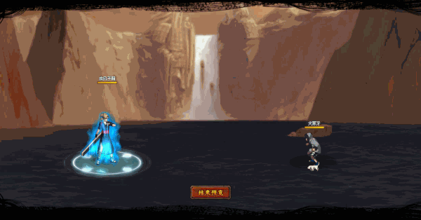

# Temari

<figure><figcaption></figcaption></figure>

* Lực tay: 26.000 (26%)
* Nhanh nhẹn: 32.000 (32%)
* Tinh thần: 32.000 (32%)
* Thể lực: 320.000 (32%)

### Thiên phú

* Tăng lượng lớn nhạy bén và tinh thần theo phần trăm. Bẩm sinh có 82% tốc độ, 60% tỷ lệ tổn thương và 50% tỷ lệ miễn thương. Khi ninja này lên trận, giảm địch 50% tốc độ và 28% tỷ lệ miễn thương. Tăng phe ta 25% lực công, 30% tỷ lệ tổn thương và 80% tỷ lệ chính xác. Bỏ qua 20% lực công và 150% phản thương của địch. Miễn dịch Phong Ngục và Chủng Tử vong.

### Kỹ năng

* Tấn công tất cả kẻ địch với hệ số 330%. Có 80% tỷ lệ gây Phong Ngục (không thể hành động, không thể xua tan) địch trong 2 hiệp và áp dụng Phẫn Diệt (DOT hệ số 90%) (không thể xua tan) trong 2 hiệp. Tăng hàng giữa/sau 25% lực công và 30% tỷ lệ hợp kích, tăng hàng đầu 500% phòng ngự. Giảm phe địch 90% khả năng hồi HP. Hồi bản thân 68 nộ, đồng đội 30 nộ.

| Chi Tiết Hiệu Ứng                                                                                                                                          |
| ---------------------------------------------------------------------------------------------------------------------------------------------------------- |
| **Chủng Tử Vong:** Chết ngay lập tức khi đến lượt \[ngoài trừ lượt Hợp Kích (nhưng hợp kích vẫn tính lượt có thể lợi dụng Hợp Kích để giải Chủng Tử Vong)] |
| **Phẫn Diệt:** DOT cứng                                                                                                                                    |
| **Phong Ngục:** CC cứng                                                                                                                                    |
