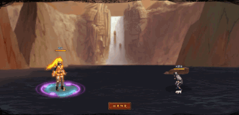

# Uzumaki Naruko

<figure><figcaption></figcaption></figure>

* Lực tay: 27.000 (27%)
* Tinh thần: 38.000 (38%)
* Nhanh nhẹn: 38.000 (38%)
* Thể lực: 420.000 (42%)

### Thiên phú

* Tăng lượng lớn nhạy bén, tinh thần và thể lực theo phần trăm. Bẩm sinh có 92% tốc độ, 60% tỷ lệ tổn thương và 60% tỷ lệ miễn thương. Khi ninja này lên trận, tăng phe ta 116% tốc độ và 30% HP. Tăng đồng minh nam bên ta 40% tỷ lệ tổn thương, 30% lực công và tỷ lệ thành công khống chế. Giảm ninja nam phe địch 30% phòng thủ và miễn giảm sát thương cuối. Giảm ninja nữ đối phương 5% tốc độ nhưng tăng phòng thủ của chúng lên 20%. Bỏ qua 150% phản thương. Miễn nhiễm với Mê Hoặc, Hỗn Loạn và Chủng Tử Vong.
* **Thiên phú thức tỉnh lv 1**: Sau khi bị tấn công, có 30% đưa bản thân và trạng thái Thiên Thủ

### Kỹ Năng

* Tấn công tất cả kẻ thù hệ số 300%, có 90% tỷ lệ gây Tàn Phế hoặc Choáng ninja nữ bên địch trong 2 hiệp . Có 110% tỷ lệ gây Hỗn Loạn ninja nam bên địch trong 2 hiệp và 50% khiến ninja nam bên địch vào trạng thái Suy Yếu (tốc độ và phòng thủ giảm 40%, không thể xua tan). Tăng ninja Nam đồng minh 30% tỷ lệ tổn thương và 50% tỷ lệ bạo kích (có thể phá vỡ giới hạn) trong 2 hiệp. Giảm ninja Nam phe địch 30% phòng thủ và  40% tỷ lệ tổn thương trong 2 hiệp. Hồi bản thân 68 nộ, đồng minh 30 nộ.

| Chi Tiết Hiệu Ứng                                                                                                                                          |
| ---------------------------------------------------------------------------------------------------------------------------------------------------------- |
| **Hỗn Loạn (CC mềm):** Tấn công đồng minh (Đánh Thường)                                                                                                    |
| **Chủng Tử Vong:** Chết ngay lập tức khi đến lượt \[ngoài trừ lượt Hợp Kích (nhưng hợp kích vẫn tính lượt có thể lợi dụng Hợp Kích để giải Chủng Tử Vong)] |
| **Tàn Phế:** CC cứng                                                                                                                                       |
| **Mê Hoặc:** Tăng 120% tỷ lệ tổn thương và sát thương gây ra. Hỗn Loạn và không thế xua tan.                                                               |
| **Suy Yếu:** Giảm 40% tốc độ và phòng thủ. Không thể nhận hiệu ứng tăng ích. Không thể xua tan.                                                            |
| **Choáng:** CC mềm                                                                                                                                         |
| **Thiên Thủ:** Không nhận sát thương. Không thể xóa                                                                                                        |
