# Bạc Tốn Up Vĩ

**- Lưu Ý: Số bạc đưa ra trong bài viết không tính bạo kích nên số bạc tốn có thể ít so với số bạc bên dưới.**

**Nhất Vĩ**

<figure>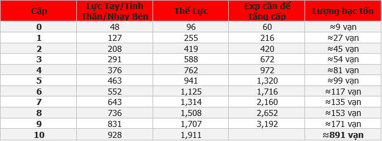<figcaption></figcaption></figure>

**Nhị Vĩ**

<figure><figcaption></figcaption></figure>

**Tam Vĩ**

<figure>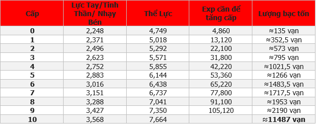<figcaption></figcaption></figure>

**Tứ Vĩ**

<figure>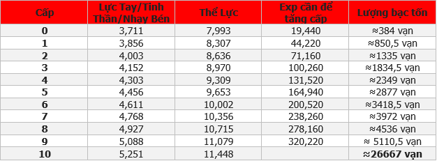<figcaption></figcaption></figure>

**Ngũ Vĩ**

<figure>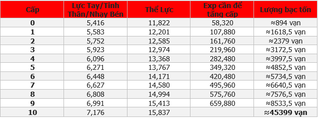<figcaption></figcaption></figure>

**Lục Vĩ**

<figure>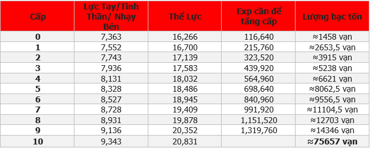<figcaption></figcaption></figure>

**Thất Vĩ**

<figure><figcaption></figcaption></figure>

**Bát Vĩ**

<figure><figcaption></figcaption></figure>

**Cửu Vĩ**

<figure><figcaption></figcaption></figure>

**Thập Vĩ**

<figure><figcaption></figcaption></figure>

**Ma-Nhất Vĩ**

<figure>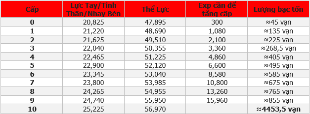<figcaption></figcaption></figure>

**Ma-Nhị Vĩ**

<figure><figcaption></figcaption></figure>

**Ma-Tam Vĩ**

<figure>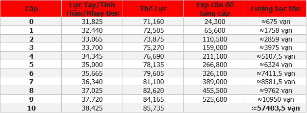<figcaption></figcaption></figure>

**Ma-Tứ Vĩ**

<figure>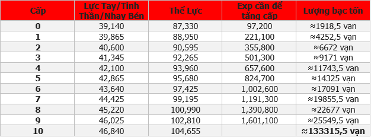<figcaption></figcaption></figure>

**Ma-Ngũ Vĩ**

<figure>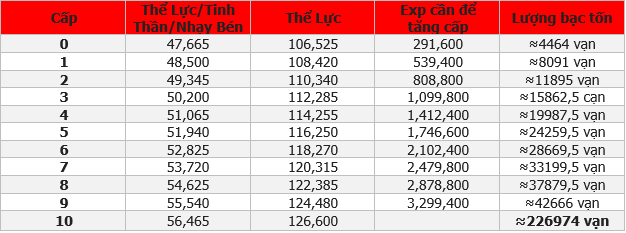<figcaption></figcaption></figure>

**Ma-Lục Vĩ**

<figure><figcaption></figcaption></figure>

**Ma-Thất Vĩ**

<figure><figcaption></figcaption></figure>

**Ma-Bát Vĩ**

<figure>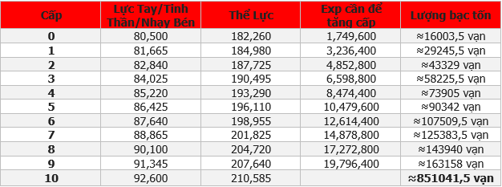<figcaption></figcaption></figure>

**Ma-Cửu Vĩ**

<figure><figcaption></figcaption></figure>

**Ma-Thập Vĩ**

<figure>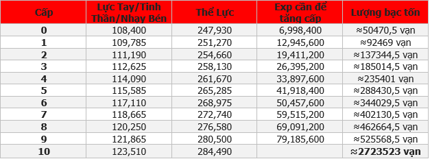<figcaption></figcaption></figure>

**Tiên-Nhất Vĩ**

<figure><figcaption></figcaption></figure>

**Tiên-Nhị Vĩ**

<figure><figcaption></figcaption></figure>

**Tiên-Tam Vĩ**

<figure>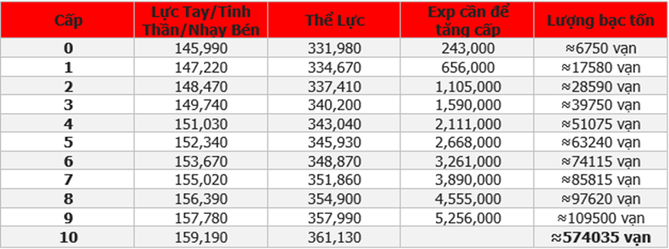<figcaption></figcaption></figure>

**Tiên-Tứ Vĩ**

<figure>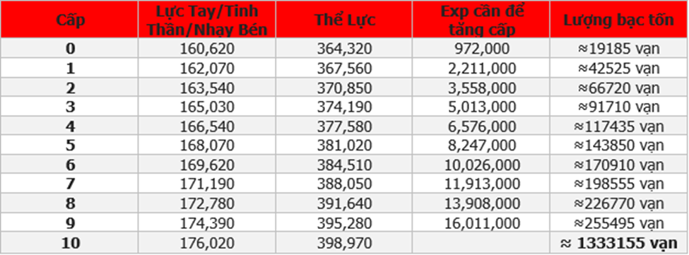<figcaption></figcaption></figure>

**Tiên-Ngũ Vĩ**

<figure>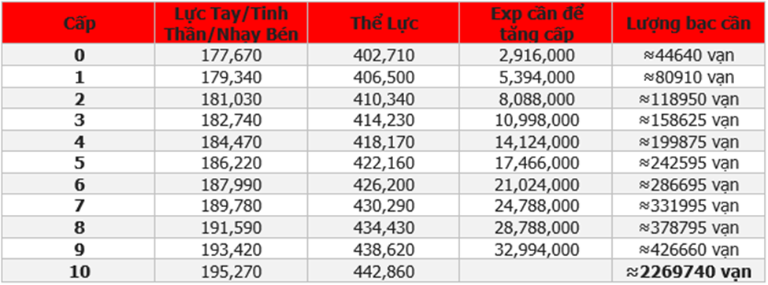<figcaption></figcaption></figure>

**Tiên-Lục Vĩ**

<figure>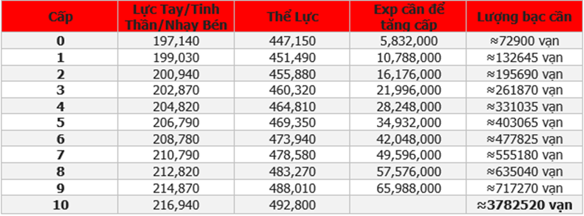<figcaption></figcaption></figure>

**Tiên-Thất Vĩ**

<figure>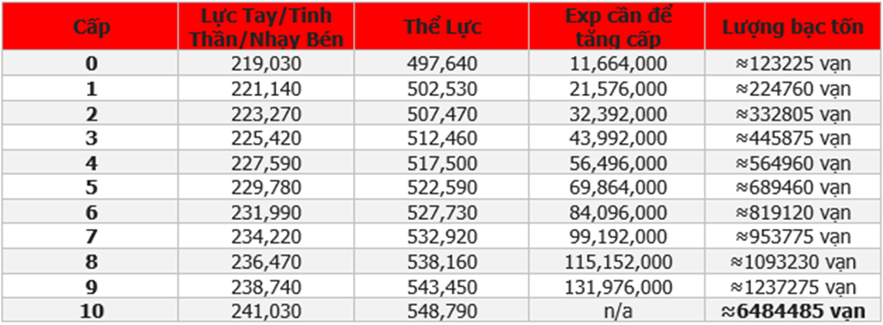<figcaption></figcaption></figure>

**Tiên-Bát Vĩ**

<figure>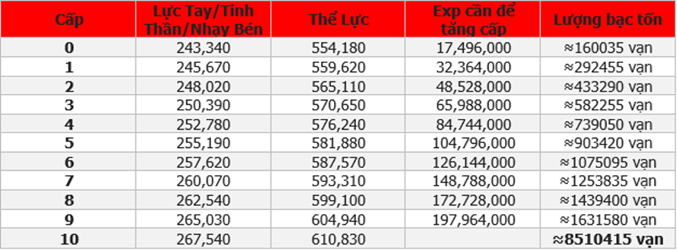<figcaption></figcaption></figure>

**Tiên-Cửu Vĩ**

<figure>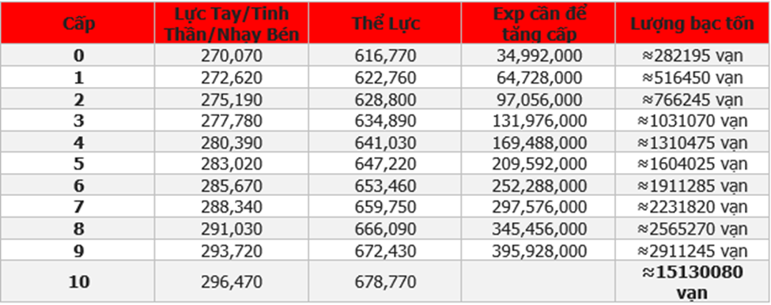<figcaption></figcaption></figure>

**Tiên-Thập Vĩ**

<figure>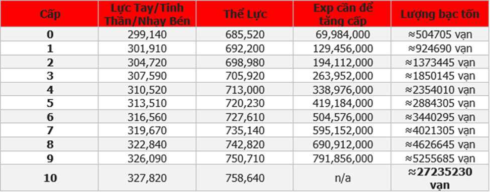<figcaption></figcaption></figure>
