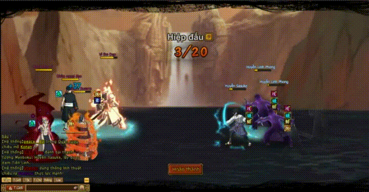

# Hợp Kích, Cứu Viện và Đỡ Đòn

<figure><figcaption></figcaption></figure>

Ninja có tĩ lệ hợp kích .png>) trên cùng một hàng có thể hợp kích với nhau, khi ninja hợp kích sẽ xuất hiện dòng chữ .png>), có thể tăng tỉ lệ hợp kích bằng nhiêu cách.

Các trường hợp **Hợp Kích**

<figure><figcaption></figcaption></figure>

**Quy tắc khi hợp kích đó là các ninja bên trái sẽ hợp kích với ninja bên phải.Mỗi ninja trong 1 lượt chỉ được hợp kích 1 lần, khi ninja được thêm lượt bị khóa thì hợp kích sẽ thất bại.**

**Cụ Tam**: A

**Toneri**: B

**Hinata**: C

* A hợp kích, B được thêm lượt (thất bại nếu B bị khóa)
* B hợp kích, C được thêm lượt (thất bại nếu C bị khóa)
* C hợp kích, A được thêm lượt (thất bại nếu A bị khóa)

**Các kỹ năng tăng hợp kích:**

| Skill                                                                                                                       |                                                                                                                   |
| --------------------------------------------------------------------------------------------------------------------------- | ----------------------------------------------------------------------------------------------------------------- |
| .png>)                                                                                   | Công hàng giửa, hệ số 120%, tăng 100% tĩ lệ hợp kích trong 1 lượt.                                                |
| .png>).png>).png>) | Công hàng giửa, hệ số 170%, tăng 100% tĩ lệ hợp kích trong 3 lượt.                                                |
| .png>)                                                                                   | Công hàng giửa, hệ số 200%, tăng hàng giửa hợp kích 20% trong 2 lượt và tăng nhân vật Tổn thương 20% trong 2 lượt |

<figure><figcaption></figcaption></figure>

Các ninja có tĩ lệ cứu viện .png>) khi bị công kích sẽ có sác xuất được cứu viện, ninja được cứu viện sát thương nhận phải sẽ giảm 90%. Và ninja được cứu viện củng như ninja cứu viện đều nhận phải sát thương 10% như nhau

**Trên trận hình phải có ít nhất 2 ninja mới có thể sử dụng cứu viện**

<figure><figcaption></figcaption></figure>

**Itachi**: A

**Main**: B

**Sát thương nhận phải khi quái đánh: A-376.273hp, B-446.980hp**

* B được A cứu viện sát thương nhận phải giảm 90%:  446.980-90%=44.698
* A cứu viện cho B nên nhận thêm 10% sát thương: 376.273+44.698=420.971

**Các kỹ năng tăng cứu viện:**

| .png>) | Công hàng giửa, hệ số 120%, tăng 100% tĩ lệ cứu viện trong 2 lượt. |
| ----------------------------------------- | ------------------------------------------------------------------ |

<figure><figcaption></figcaption></figure>

Ninja có tĩ lệ đở đòn khi bị công kích sẽ có sác xuất đở đòn.Ninja đở đòn sát thương nhận phải giảm 65%-70%, ninja đở đòn sau khi đở đòn sẽ thực hiện phản đòn, sát thương phản đòn bằng sát thương đánh thường ninja gây ra cho kẽ tấn công.

**A tấn công B: -1000 hp**

**B tấn công A:-2000 hp**

**Khi B đở đòn:**

* hp mất -300hp
* phản đòn –A 2000hp

**Khi A đở đòn:**

* hp mất -600hp
* phản đòn –B 1000hp

<figure><figcaption></figcaption></figure>

<figure><figcaption></figcaption></figure>
