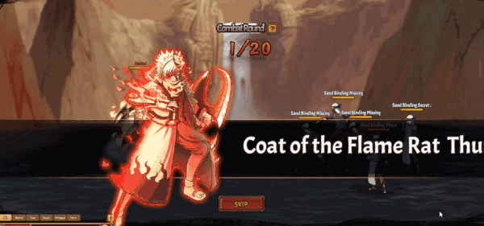

# Hỏa Thử Bì Y•Lôi

<figure><figcaption></figcaption></figure>

**Hỏa Thử Bì Y•Lôi (1,600,000 Áo nghĩa và 1,805,000 Áo nghĩa thức tỉnh)**

|              | **Chi Tiết**                                                                                                                                                                                                                                                                                                                                                                                                                                            | **Tiêu Tốn**                                                            |
| ------------ | ------------------------------------------------------------------------------------------------------------------------------------------------------------------------------------------------------------------------------------------------------------------------------------------------------------------------------------------------------------------------------------------------------------------------------------------------------- | ----------------------------------------------------------------------- |
| **Bậc 1**    | – Tấn công tất cả kẻ thù hệ số 120%. Tăng đồng minh tốc độ thêm 2% trong 1 hiệp.                                                                                                                                                                                                                                                                                                                                                                        | <ul><li>1,600,000 Áo nghĩa</li><li>160,000 Áo nghĩa thức tỉnh</li></ul> |
| **Bậc 2**    | – Tấn công tất cả kẻ thù hệ số (220% / 240% / 260% / 280% / 300%). Tăng đồng minh tốc độ thêm 2% cho 1 hiệp.                                                                                                                                                                                                                                                                                                                                            | <ul><li>30,000⇒34,000 Áo nghĩa thức tỉnh(để nâng max cấp)</li></ul>     |
| **Bậc 3**    | – Tấn công tất cả kẻ thù hệ số 300%. Tăng đồng minh tốc độ thêm 2% trong 1 hiệp. Giảm tỷ lệ tổn thương hàng giữa kẻ địch (6% / 12% / 18% / 24% / 30%) trong 2 hiệp.                                                                                                                                                                                                                                                                                     | <ul><li>35,000⇒39,000 Áo nghĩa thức tỉnh(để nâng max cấp)</li></ul>     |
| **Bậc 4**    | – Tấn công tất cả kẻ thù hệ số 300%. Tăng đồng minh tốc độ thêm 2% trong 1 hiệp và tỷ lệ thành công khống chế của hàng giữa đồng minh (5% / 10% / 15% / 20% / 25%) trong 2 hiệp. Giảm tỷ lệ tổn thương hàng giữa kẻ địch 30% trong 2 hiệp.                                                                                                                                                                                                              | <ul><li>40,000⇒44,000 Áo nghĩa thức tỉnh(để nâng max cấp)</li></ul>     |
| **Bậc 5**    | – Tấn công tất cả kẻ thù hệ số 300%. Tăng đồng minh tốc độ (4% / 8% / 12% / 16% / 20%) trong 1 hiệp và tỷ lệ thành công khống chế của hàng giữa đồng minh 25% trong 2 hiệp. Giảm tỷ lệ tổn thương hàng giữa kẻ địch 30% trong 2 hiệp.                                                                                                                                                                                                                   | <ul><li>45,000⇒49,000 Áo nghĩa thức tỉnh(để nâng max cấp)</li></ul>     |
| **Bậc 6**    | – Tấn công tất cả kẻ thù, gây sát thương 300%. Tăng đồng minh tốc độ thêm 20% trong 1 hiệp, tỷ lệ thành công khống chế của hàng giữa đồng minh 25% trong 2 hiệp. Giảm tỷ lệ tổn thương hàng giữa kẻ địch 30% trong 2 hiệp và tỷ lệ cứu viện (10% / 20% / 30% / 40% / 50%) trong 2 hiệp.                                                                                                                                                                 | <ul><li>50,000⇒54,000 Áo nghĩa thức tỉnh(để nâng max cấp)</li></ul>     |
| **Bậc 7**    | – Tấn công tất cả kẻ thù hệ số 300%. Tăng đồng minh tốc độ thêm 20% trong 1 hiệp, tỷ lệ thành công khống chế của hàng giữa đồng minh 25% trong 2 hiệp và tỷ lệ tổn thương (5% / 10% / 15% / 20% / 25%) trong 2 hiệp. Giảm tỷ lệ tổn thương hàng giữa kẻ địch 30% trong 2 hiệp và tỷ lệ cứu viện 50% trong 2 hiệp.                                                                                                                                       | <ul><li>55,000⇒59,000 Áo nghĩa thức tỉnh(để nâng max cấp)</li></ul>     |
| **Bậc Cuối** | – Tấn công tất cả kẻ thù hệ số 300%. Tăng đồng minh tốc độ thêm 20% trong 1 hiệp, tỷ lệ thành công khống chế của hàng giữa đồng minh 25% trong 2 hiệp và tỷ lệ tổn thương thêm 25% trong 2 hiệp. Giảm tỷ lệ tổn thương hàng giữa kẻ địch 30% trong 2 hiệp và tỷ lệ cứu viện 50% trong 2 hiệp. Có (50% / 100% / 100% / 100% / 100%) cơ hội vô hiệu hóa (1 / 1 / 2 / 3 / tất cả) kẻ thù hồi phục (Không thể phục hồi HP. Không thể xua tan) trong 2 hiệp. | <ul><li>60,000⇒64,000 Áo nghĩa thức tỉnh(để nâng max cấp)</li></ul>     |
