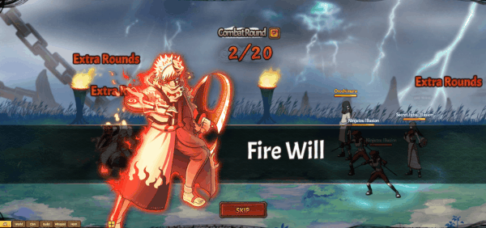

# Hỏa Ý Chí

<figure><figcaption></figcaption></figure>

**Hỏa Ý Chí (1,600,000 Áo nghĩa và 1,395,000 Áo nghĩa thức tỉnh)**

|              | **Chi Tiết**                                                                                                                                                                                                                                                                                                                                         | **Tiêu Tốn**                                                            |
| ------------ | ---------------------------------------------------------------------------------------------------------------------------------------------------------------------------------------------------------------------------------------------------------------------------------------------------------------------------------------------------- | ----------------------------------------------------------------------- |
| **Bậc 1**    | – Tấn công tất cả kẻ thù hệ số 100%. Có 10% gây Nghiền Nát(Tạm dịch) kẻ thù trong 2 hiệp.                                                                                                                                                                                                                                                            | <ul><li>1,600,000 Áo nghĩa</li><li>100,000 Áo nghĩa thức tỉnh</li></ul> |
| **Bậc 2**    | – Tấn công tất cả kẻ thù hệ số (200% / 220% / 240% / 260% / 280%). Có 10% gây Nghiền Nát(Tạm dịch) kẻ thù trong 2 hiệp.                                                                                                                                                                                                                              | <ul><li>20,000⇒24,000 Áo nghĩa thức tỉnh(để nâng max cấp)</li></ul>     |
| **Bậc 3**    | – Tấn công tất cả kẻ thù hệ số 280%. Có 10% gây Nghiền Nát(Tạm dịch) kẻ thù trong 2 hiệp. Giảm phòng thủ của hàng sau kẻ thù (5% / ? / ? / 30%) trong 2 hiệp.                                                                                                                                                                                        | <ul><li>25,000⇒29,000 Áo nghĩa thức tỉnh(để nâng max cấp)</li></ul>     |
| **Bậc 4**    | – Tấn công tất cả kẻ thù hệ số 280%. Có 10% gây Nghiền Nát(Tạm dịch) kẻ thù trong 2 hiệp. Giảm 30% phòng thủ hàng sau kẻ thù trong 2 hiệp và tăng lực công hàng giữa đồng minh (6% / 12% / 18% / 24% / 30%) trong 2 hiệp.                                                                                                                            | <ul><li>30,000⇒34,000 Áo nghĩa thức tỉnh(để nâng max cấp)</li></ul>     |
| **Bậc 5**    | – Tấn công tất cả kẻ thù hệ số 280%. Có (20% / 30% / 40% / 50% / 60%) gây Nghiền Nát(Tạm dịch) kẻ thù trong 2 hiệp. Giảm 30% phòng thủ hàng sau kẻ thù trong 2 hiệp và tăng lực công hàng giữa đồng minh thêm 30% trong 2 hiệp.                                                                                                                      | <ul><li>35,000⇒39,000 Áo nghĩa thức tỉnh(để nâng max cấp)</li></ul>     |
| **Bậc 6**    | – Tấn công tất cả kẻ thù hệ số 280%. Có 60% gây Nghiền Nát(Tạm dịch) kẻ thù trong 2 hiệp. Giảm phòng thủ hàng sau kẻ thù đi 30% trong 2 hiệp và tốc độ (5% / 10% / 15% / 20% / 25%) trong 2 hiệp, tăng lực công hàng giữa đồng minh trong 2 hiệp.                                                                                                    | <ul><li>40,000⇒44,000 Áo nghĩa thức tỉnh(để nâng max cấp)</li></ul>     |
| **Bậc 7**    | – Tấn công tất cả kẻ thù hệ số 280%. Có 60% gây Nghiền Nát(Tạm dịch) kẻ thù trong 2 hiệp. Giảm 30% phòng thủ của hàng sau đối phương trong 2 hiệp và tốc độ 25% trong 2 hiệp, tăng lực công hàng giữa đồng minh thêm 30% trong 2 hiệp và hồi (10/20/30/40/50) điểm nộ.                                                                               | <ul><li>45,000⇒49,000 Áo nghĩa thức tỉnh(để nâng max cấp)</li></ul>     |
| **Bậc Cuối** | – Tấn công tất cả kẻ thù hệ số 280%. Có 60% gây Nghiền Nát(Tạm dịch) kẻ thù trong 2 hiệp. Giảm 30% phòng thủ của đối phương trong 2 hiệp và tốc độ 25% trong 2 hiệp, tăng lực công hàng giữa đồng minh thêm 30% trong 2 hiệp và hồi 50 điểm nộ. Có (50% / 100% / 100% / 100% / 100%) cơ hội xóa hiệu ứng xấu cho (1 / 1 / 2 / 3 / tất cả) đồng minh. | <ul><li>50,000⇒54,000 Áo nghĩa thức tỉnh(để nâng max cấp)</li></ul>     |
