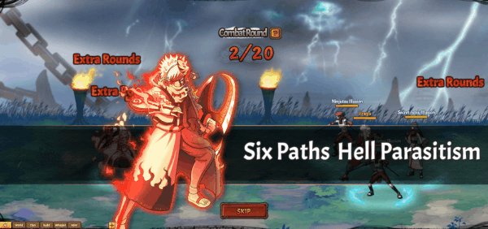

# Lục Đạo•Hoàng Tuyền

<figure><figcaption></figcaption></figure>

**Lục Đạo•Hoàng Tuyền (1,600,000 Áo nghĩa và 1,590,000 Áo nghĩa thức tỉnh)**

|              | **Chi Tiết**                                                                                                                                                                                                                                                                                                                                                                                          | **Tiêu Tốn**                                                            |
| ------------ | ----------------------------------------------------------------------------------------------------------------------------------------------------------------------------------------------------------------------------------------------------------------------------------------------------------------------------------------------------------------------------------------------------- | ----------------------------------------------------------------------- |
| **Bậc 1**    | – Tấn công tất cả kẻ thù hệ số 120%. Có một tỷ lệ nhỏ (10%) Chủng Tử Vong lên 1 kẻ thù ngẫu nhiên.                                                                                                                                                                                                                                                                                                    | <ul><li>1,600,000 Áo nghĩa</li><li>120,000 Áo nghĩa thức tỉnh</li></ul> |
| **Bậc 2**    | – Tấn công tất cả kẻ thù hệ số (220% / 240% / 260% / 280% / 300%). Có một tỷ lệ nhỏ (10%) Chủng Tử Vong lên 1 kẻ thù ngẫu nhiên.                                                                                                                                                                                                                                                                      | <ul><li>25,000⇒29,000 Áo nghĩa thức tỉnh(để nâng max cấp)</li></ul>     |
| **Bậc 3**    | – Tấn công tất cả kẻ thù hệ số 300%. Có một tỷ lệ nhỏ (10%) Chủng Tử Vong lên 1 kẻ thù ngẫu nhiên. Giảm tỷ lệ miễn thương hàng đầu đối phương (10% / 20% / 30% / 40% / 50%) trong 2 hiệp.                                                                                                                                                                                                             | <ul><li>30,000⇒34,000 Áo nghĩa thức tỉnh(để nâng max cấp)</li></ul>     |
| **Bậc 4**    | – Tấn công tất cả kẻ thù hệ số 300%. Có một tỷ lệ nhỏ (10%) Chủng Tử Vong lên 1 kẻ thù ngẫu nhiên. Tăng tỷ lệ thành công khống chế của hàng sau đồng minh thêm (5% / 10% / 15% / 20% / 25%) trong 2 hiệp. Giảm tỷ lệ miễn thương hàng đầu kẻ địch đi 50% trong 2 hiệp.                                                                                                                                | <ul><li>35,000⇒39,000 Áo nghĩa thức tỉnh(để nâng max cấp)</li></ul>     |
| **Bậc 5**    | – Tấn công tất cả kẻ thù hệ số 300%. Có (30% / ? / ? / ? / 100%) Chủng Tử Vong lên (1 / ? / ? / ? 2) kẻ thù ngẫu nhiên. Tăng tỷ lệ thành công khống chế của hàng sau đồng minh thêm 25% trong 2 hiệp. Giảm tỷ lệ miễn thương hàng đầu kẻ địch đi 50% trong 2 hiệp.                                                                                                                                    | <ul><li>40,000⇒44,000 Áo nghĩa thức tỉnh(để nâng max cấp)</li></ul>     |
| **Bậc 6**    | – Tấn công tất cả kẻ thù hệ số 300%. Gây Chủng Tử Vong lên 2 kẻ thù ngẫu nhiên. Tăng tỷ lệ thành công khống chế của hàng sau đồng minh thêm 25% trong 2 hiệp. Giảm tỷ lệ miễn thương hàng đầu kẻ địch đi 50% trong 2 hiệp và tỷ lệ hợp kích của hàng giữa kẻ địch (20% / 40% / 60% / 80% / 100%) trong 2 hiệp.                                                                                        | <ul><li>45,000⇒49,000 Áo nghĩa thức tỉnh(để nâng max cấp)</li></ul>     |
| **Bậc 7**    | – Tấn công tất cả kẻ thù hệ số 300%. Gây Chủng Tử Vong lên 2 kẻ thù ngẫu nhiên. Tăng tỷ lệ thành công khống chế của hàng sau đồng minh thêm 25% trong 2 hiệp và tốc độ thêm (4% / 8% / 12% / 16% / 20%) trong 2 hiệp. Giảm tỷ lệ miễn thương hàng đầu kẻ địch đi 50% trong 2 hiệp và tỷ lệ hợp kích của hàng giữa kẻ địch 100% trong 2 hiệp.                                                          | <ul><li>50,000⇒54,000 Áo nghĩa thức tỉnh(để nâng max cấp)</li></ul>     |
| **Bậc Cuối** | – Tấn công tất cả kẻ thù hệ số 300%. Gây Chủng Tử Vong lên 2 kẻ thù ngẫu nhiên. Tăng tỷ lệ thành công khống chế của hàng sau đồng minh thêm 25% trong 2 hiệp và tốc độ thêm 20% trong 2 hiệp. Giảm tỷ lệ miễn thương hàng đầu kẻ địch đi 50% trong 2 hiệp và tỷ lệ hợp kích của hàng giữa kẻ địch 100% trong 2 hiệp. Có (50% / ? / ? / 100%) cơ hội cho (1 / ? / ? / 3) đồng mình Miễn Chủng Tử Vong. | <ul><li>55,000⇒59,000 Áo nghĩa thức tỉnh(để nâng max cấp)</li></ul>     |
