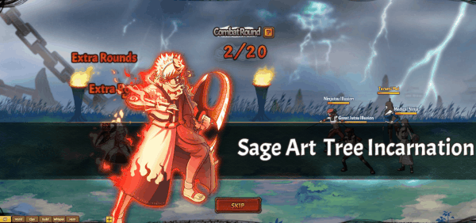

# Tiên Pháp•Chân Thụ

<figure><figcaption></figcaption></figure>

**Tiên Pháp • Chân Thụ (800,000 Áo nghĩa và 1,200,000 Áo nghĩa thức tỉnh)**

|              | **Chi Tiết**                                                                                                                                                                                                                                                                                                                                                                               | **Tiêu Tốn**                                                         |
| ------------ | ------------------------------------------------------------------------------------------------------------------------------------------------------------------------------------------------------------------------------------------------------------------------------------------------------------------------------------------------------------------------------------------ | -------------------------------------------------------------------- |
| **Bậc 1**    | – Tấn công tất cả kẻ thù hệ số 100% và giảm kẻ thù 5 điểm nộ.                                                                                                                                                                                                                                                                                                                              | <ul><li>800,000 Áo nghĩa</li><li>80,000 Áo nghĩa thức tỉnh</li></ul> |
| **Bậc 2**    | – Tấn công tất cả kẻ thù hệ số (200% / 220% / 240% / 260% / 280%) và giảm kẻ thù 5 điểm nộ.                                                                                                                                                                                                                                                                                                | <ul><li>15,000⇒19,000 Áo nghĩa thức tỉnh(để nâng max cấp)</li></ul>  |
| **Bậc 3**    | – Tấn công tất cả kẻ thù hệ số 280% và giảm kẻ thù 5 điểm nộ. Giảm tỷ lệ miễn thương của hàng giữa đối phương (5% / ? / ? / ? / 30%) trong 2 hiệp.                                                                                                                                                                                                                                         | <ul><li>20,000⇒24,000 Áo nghĩa thức tỉnh(để nâng max cấp)</li></ul>  |
| **Bậc 4**    | – Tấn công tất cả kẻ thù hệ số 280% và giảm kẻ thù 5 điểm nộ. Giảm tỷ lệ miễn thương của hàng giữa đối phương đi 30% trong 2 hiệp và tăng lực công hàng đầu đồng minh (5% / 10% / 15% / 20% / 25%) trong 2 hiệp.                                                                                                                                                                           | <ul><li>25,000⇒29,000 Áo nghĩa thức tỉnh(để nâng max cấp)</li></ul>  |
| **Bậc 5**    | – Tấn công tất cả kẻ thù hệ số 280% và giảm nộ kẻ thù (10 / 20 / 30 / 40 / 50) điểm. Giảm tỷ lệ miễn thương của hàng giữa đối phương đi 30% trong 2 hiệp và tăng lực công hàng đầu đồng minh thêm 25% trong 2 hiệp.                                                                                                                                                                        | <ul><li>30,000⇒34,000 Áo nghĩa thức tỉnh(để nâng max cấp)</li></ul>  |
| **Bậc 6**    | – Tấn công tất cả kẻ thù hệ số 280% và giảm kẻ thù 50 điểm nộ. Giảm tỷ lệ miễn thương của hàng giữa đối phương đi 30% trong 2 hiệp và tăng lực công hàng đầu thêm 25% trong 2 hiệp. Có (30% / 40% / 50% / 60% / 70%) gây khống chế hàng giữa đối phương trong 2 hiệp.                                                                                                                      | <ul><li>35,000⇒39,000 Áo nghĩa thức tỉnh(để nâng max cấp)</li></ul>  |
| **Bậc 7**    | – Tấn công tất cả kẻ thù hệ số 280% và giảm kẻ thù 50 điểm nộ. Giảm tỷ lệ miễh thương hàng giữa đối phương đi 30% trong 2 hiệp. Tăng lực công hàng đầu đồng minh thêm 25% trong 2 hiệp và tốc độ (10% / 20% / 30% / 40% / 50%) trong 2 hiệp, xóa mọi hiệu ứng xấu của hàng đầu đồng minh. Có 70% gây khống chế hàng giữa đối phương trong 2 hiệp.                                          | <ul><li>40,000⇒44,000 Áo nghĩa thức tỉnh(để nâng max cấp)</li></ul>  |
| **Bậc Cuối** | – Tấn công tất cả kẻ thù hệ số 280% và giảm kẻ thù 50 điểm nộ. Giảm tỷ lệ miễh thương hàng giữa đối phương đi 30% trong 2 hiệp. Tăng lực công hàng đầu đồng minh thêm 25% trong 2 hiệp và tốc độ thêm 50% trong 2 hiệp, xóa mọi hiệu ứng xấu của hàng đầu đồng minh. Hồi HP của đồng minh hệ số (80% / 100% / 120% / 140% / 160%). Có 70% gây khống chế hàng giữa đối phương trong 2 hiệp. | <ul><li>45,000⇒49,000 Áo nghĩa thức tỉnh(để nâng max cấp)</li></ul>  |
