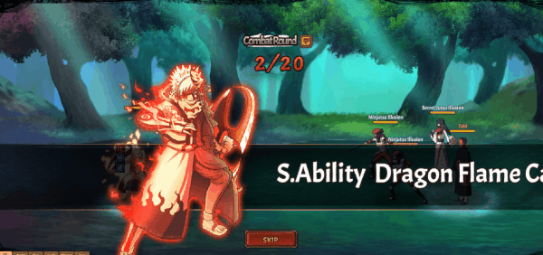

# Viêm Long

<figure><figcaption></figcaption></figure>

**Viêm Long (800,000 Áo nghĩa và 1,005,000 Áo nghĩa thức tỉnh)**

|              | **Chi Tiết**                                                                                                                                                                                                                                                                                                                                                                                                                    | **Tiêu Tốn**                                                                            |
| ------------ | ------------------------------------------------------------------------------------------------------------------------------------------------------------------------------------------------------------------------------------------------------------------------------------------------------------------------------------------------------------------------------------------------------------------------------- | --------------------------------------------------------------------------------------- |
| **Bậc 1**    | – Tấn công tất cả kẻ thù hệ số 100% và tăng tất cả các đồng minh tỷ lệ né tránh thêm 10% (có thể phá vỡ giới hạn) trong 1 hiệp.                                                                                                                                                                                                                                                                                                 | <ul><li>800,000 Áo nghĩa (để mở khóa skill)</li><li>60,000 Áo nghĩa thức tỉnh</li></ul> |
| **Bậc 2**    | – Tấn công tất cả kẻ thù hệ số (200% / 220% / 240% / 260% / 280%) và tăng tất cả các đồng minh tỷ lệ né tránh 10% (có thể phá vỡ giới hạn) trong 1 hiệp.                                                                                                                                                                                                                                                                        | <ul><li>10,000⇒14,000 Áo nghĩa thức tỉnh(để nâng max cấp)</li></ul>                     |
| **Bậc 3**    | – Tấn công tất cả hệ số 280% và tăng tất cả các đồng minh tỷ lệ né tránh 10% (có thể phá vỡ giới hạn) trong 1 hiệp. Giảm phòng thủ hàng đầu đối phương (6% / 12% / 18% / 24% / 30%) trong 2 hiệp.                                                                                                                                                                                                                               | <ul><li>15,000⇒19,000 Áo nghĩa thức tỉnh(để nâng max cấp)</li></ul>                     |
| **Bậc 4**    | – Tấn công tất cả kẻ thù hệ số 280% và tăng tất cả các đồng minh tỷ lệ né tránh 10% (có thể phá vỡ giới hạn) trong 1 hiệp và tăng tỷ lệ tổn thương của hàng sau đồng minh thêm (6% / 12% / 18% / 24% / 30%) trong 2 hiệp. Giảm 30% phòng thủ hàng đầu đối phương trong 2 hiệp.                                                                                                                                                  | <ul><li>20,000⇒24,000 Áo nghĩa thức tỉnh(để nâng max cấp)</li></ul>                     |
| **Bậc 5**    | – Tấn công tất cả kẻ thù hệ số 280% và tăng tất cả các đồng minh tỷ lệ né tránh thêm (20% / 40% / 60% / 80% / 100%) (có thể phá vỡ giới hạn) trong 1 hiệp và tăng tỷ lệ tổn thương của hàng sau thêm 30% trong 2 hiệp. Giảm 30% phòng thủ hàng đầu đối phương trong 2 hiệp.                                                                                                                                                     | <ul><li>25,000⇒29,000 Áo nghĩa thức tỉnh(để nâng max cấp)</li></ul>                     |
| **Bậc 6**    | – Tấn công tất cả kẻ thù hệ số 280% và tăng tất cả các đồng minh tỷ lệ né tránh 100% (có thể phá vỡ giới hạn) trong 1 vòng và tăng tỷ lệ tổn thương của hàng sau thêm 30% trong 2 hiệp. Giảm 30% phòng thủ hàng đầu đối phương trong 2 hiệp. Có (30% / 40% / 50% / 60% / 70%) gây khống chế hàng đầu đối phương trong 2 hiệp.                                                                                                   | <ul><li>30,000⇒34,000 Áo nghĩa thức tỉnh(để nâng max cấp)</li></ul>                     |
| **Bậc 7**    | – Tấn công tất cả kẻ thù hệ số 280% và tăng tất cả đồng minh tỷ lệ né tránh lên 100% (có thể phá vỡ giới hạn) trong 1 hiệp và tăng tỷ lệ tổn thương của hàng sau thêm 30% và tốc độ thêm (5% / 10% / 15% / 20% / 25%) trong 2 hiệp. Giảm 30% phòng thủ hàng đầu đối phương trong 2 hiệp. Có 70% gây khống chế hàng đầu đối phương trong 2 hiệp.                                                                                 | <ul><li>35,000⇒39,000 Áo nghĩa thức tỉnh(để nâng max cấp)</li></ul>                     |
| **Bậc Cuối** | – Tấn công tất cả kẻ thù hệ số 280% và tăng tất cả các đồng minh tỷ lệ né tránh 100% (có thể phá vỡ giới hạn) trong 1 hiệp và tăng tỷ lệ tổn thương của hàng sau thêm 30% trong 2 hiệp và tốc độ thêm 25% trong 2 hiệp. Giảm 30% phòng thủ hàng đầu đối phương trong 2 hiệp. Có 70% gây khống chế hàng đầu đối phương trong 2 hiệp và gây Bạo Liệt (DOT) cho tất cả kẻ thù hệ số (60% / 80% / 100% / 120% / 140%) trong 1 hiệp. | <ul><li>40,000⇒44,000 Áo nghĩa thức tỉnh(để nâng max cấp)</li></ul>                     |
